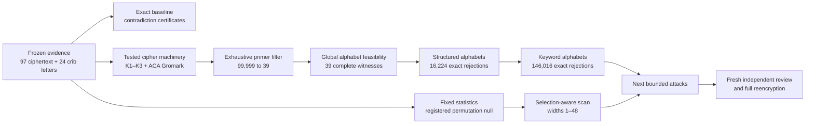

# kryptos-research

Reproducible evidence, cipher tooling, exact constraints, and bounded statistical
experiments for the 97-letter Kryptos K4 ciphertext. The repository implements
the staged program in the [K4 agent plan](docs/kryptos-k4-agent-plan.md) and
preserves the inputs and outputs needed to audit each result.

**This project has not produced a K4 solution.** It has completed eight
engineering and reproduction milestones, a partial ninth evidence refresh, and
a completed tenth blind reference benchmark.
The newest exact-search result rejects all
**146,016** combinations in one precisely defined family: 39 numeric starting
keys, 12 keyword-built alphabet orders for each side of the cipher, and 26
relative rotations. That result says this family cannot produce all 24 known
K4 letters. It does not identify the intended plaintext, key, alphabets, or
historical method.

Some terms used below:

- A **crib** is plaintext known at a particular ciphertext position. K4 has 24
  published letters in two groups: `EASTNORTHEAST` and `BERLINCLOCK`.
- A **model** is one fully specified choice of cipher rules and parameters.
- An **exact exclusion** means every model in a stated finite set failed at
  least one necessary equation. It says nothing about models outside that set.
- A **primer** is the starting digit sequence for the recurrence studied in
  milestones 3 and 6–8.
- **Calibration** uses planted examples with known answers to test whether a
  search can retain or recover the answer before it is trusted on K4.

## What this project is studying

Kryptos is a sculpture at CIA headquarters containing four encrypted sections.
The first three sections, K1–K3, have known solutions and are valuable test
cases. K4 is the remaining 97-letter ciphertext. This repository studies the
encryption method as well as the plaintext: a sentence that happens to sound
right is not enough unless a defined key and algorithm reproduce every
ciphertext letter.

The public clues give four final-plaintext ranges. Positions here are counted
from 1 for people; the code uses zero-based half-open ranges.

| Human positions | Code range | Ciphertext | Known plaintext |
| --- | --- | --- | --- |
| 22–25 | `21..25` | `FLRV` | `EAST` |
| 26–34 | `25..34` | `QQPRNGKSS` | `NORTHEAST` |
| 64–69 | `63..69` | `NYPVTT` | `BERLIN` |
| 70–74 | `69..74` | `MZFPK` | `CLOCK` |

A substitution changes letters; a transposition moves their positions. A
polyalphabetic cipher changes the substitution as the message advances. The
recurrence branch studied here starts from a short sequence of digits and
generates later digits from earlier ones, then uses that digit stream while
mapping plaintext letters to ciphertext letters. Plaintext and ciphertext
alphabets may be ordinary A–Z orders, keyword-built orders, or unknown
permutations, depending on the model.

A survivor only means the known letters have not contradicted a model. A
feasibility witness is one concrete assignment showing that a flexible model
can work at the known positions; it is not recovered English. Statistical
experiments compare K4 with a declared **null** collection of shuffled texts.
For example, the width result `0.004419956` means 441 of 100,000 registered
shuffles had a selected maximum at least as extreme as K4 (with the standard
one-count adjustment). It is not the probability that a cipher theory is true.

## Current results

| Milestone | Plain-language question | Finding and why it matters | Record |
| --- | --- | --- | --- |
| 1 | What can the 24 known letters rule out immediately? | Froze the evidence. Pure rearrangement of the 97 letters and simple fixed substitutions conflict with the clues; some repeating-key periods fail, while others remain possible. | [Report](reports/milestone-1.md) |
| 2 | Can the project implement the relevant ciphers correctly? | Reproduced K1, both K2 versions, K3's permutation, and a published Gromark example in Rust and Python. Later searches therefore rest on known-answer tests. | [Report](reports/milestone-2.md) |
| 3 | Which five-digit decimal starting keys survive cheap necessary tests? | Exhaustively reduced **99,999 → 1,040 → 39**, with Rust, Python, and pinned upstream C agreement. This makes later searches finite and reviewable. | [Report](reports/milestone-3.md) |
| 4 | Are five reported K4 patterns unusual under a fixed shuffle test? | Reproduced the measurements with a pilot and one million new shuffles, including uncertainty and multiple-test correction. It checks statistics, not a decryption. | [Report](reports/milestone-4.md) |
| 5 | Does width 21 remain unusual when the best of widths 1–48 is selected every time? | Yes under this registered null: 441/100,000 shuffled texts were at least as extreme, adjusted to **0.004419956**. This corrects that width selection only. | [Report](reports/milestone-5.md) |
| 6 | Can each of the 39 digit streams fit the clues if both alphabets may be any permutations? | Yes: **39 feasible, 0 infeasible, 0 unresolved**. The broad model is too flexible to narrow the key list; its witnesses are not plaintexts. | [Report](reports/milestone-6.md) |
| 7 | Do ordinary A–Z and KRYPTOS-built alphabets make those streams work? | No. All **16,224** registered fixed-order models fail at least one known letter. | [Report](reports/milestone-7.md) |
| 8 | Do three sourced keywords and two alphabet-building rules make them work? | No. All **146,016** models fail after **3,504,384** K4 equations. The known true model round-tripped in 144 planted tests; only 98 were uniquely identified from the clue signature. | [Report](reports/milestone-8.md) |
| 9 (partial) | Which source details are trustworthy enough for later clue-based searches? | CIA text rows, selected 1999 photos, and Dunin's 2002 rubbings corroborate parts of the inscription; the original Sanborn letter and Paradigm's public terms were read. Oxford separates Carter's journals and diaries from Mace's journals and Burton's diary. Full photographic collation, measured geometry, and the 1989 Clock labels remain open. No K4 search was run. | [Report](reports/milestone-9.md), [source ledger](evidence/milestone-9.json) |
| 10 | Can an attack recover a planted model without being told the answer? | With a fresh committed hidden seed and independently regenerated cases, a separate attacker ranked the true model first on all 160 planted cases in a narrow cipher family; none of 140 out-of-family or tampered cases survived. The protocol is reusable, but each later family needs its own calibration. | [Report](reports/milestone-10.md), [run](results/BLIND-0004/run-001/completion.json) |

The width result is conditional on the registered statistic, width range,
calibration, and multiset-permutation null. It does not correct every historical
pattern search. The feasibility result uses arbitrary independent alphabet
permutations, so its witness alphabets have no claim to being meaningful words
or historical keys.

## How the research stages fit together

The project separates evidence, implementation, experiments, and interpretation.
That separation prevents a promising output from silently changing its input
data or expanding the scope of a claim.



The longer research plan has the following phases:

1. **Evidence audit.** Freeze the K4 transcription, zero-based crib positions,
   source ledger, statement provenance, and current-status gaps. A changed
   transcription invalidates dependent runs.
2. **Cryptanalytic foundations.** Implement explicit alphabets, modular
   equations, recurrence keys, substitutions, permutations, ragged columnar
   transposition, position traces, and known-answer fixtures.
3. **Exact exclusions.** Use small contradiction witnesses before expensive
   search. A model can be excluded only within its stated domain; a surviving
   necessary condition is not a solution.
4. **Statistical diagnosis.** Register statistics, null ensembles, seeds,
   selection rules, and precision decisions before simulation. Preserve raw
   counts and uncertainty rather than reporting an unexplained score.
5. **Bounded attacks.** Investigate structured key schedules, recurrences,
   documentary running keys, routes, clock-derived schedules, matrices, and
   carefully limited combinations. Milestones 3, 6, 7, and 8 cover one narrow
   recurrence branch of this phase.
6. **Candidate validation.** A serious candidate must explain all 97 letters,
   reencrypt exactly, derive its key independently of the proposed plaintext,
   recover planted examples under the same attack, and survive a fresh
   implementation review.

Milestones are reviewable work packages within these phases. Completing a
milestone does not imply that every gate in its surrounding phase is complete.
The [future milestone roadmap](docs/future-milestones.md) defines planned
milestones 9–26, their dependencies, budgets, exact-versus-heuristic boundaries,
outputs, and stop conditions.

## What comes next

The roadmap adds 18 milestones after the first eight. Milestone 9 has a
[partial evidence audit](reports/milestone-9.md): it found stronger textual and
catalog sources, inspected the original Sanborn letter and the steward's public
terms, and checked selected sculpture photographs and first-person rubbings.
The archive distinguishes Carter's excavation journals from diaries and other
authors' notebooks; no running-key text is frozen. The Clock's 80 **original**
city names cannot be assumed to match 1989 after intervening changes. Full
photographic collation, measured geometry, and period-correct clock labels
remain unresolved.
Those details cannot become search parameters until their evidence gates close.
Milestone 10's [blind reference benchmark](reports/milestone-10.md) now keeps
planted answers outside the attack process and checks recovery against a
separate verifier. Its small exact family passed all registered targets; each
larger future family still needs its own blind calibration. Milestones 11–15 cover classical schedules, generalized
recurrences, unknown alphabets, tableau/keyword families, and documentary
running keys. Milestones 16–24 cover two-clue state joins, affine and ragged
routes, clock and direction rules, small stepping machines, anomaly streams,
matrix/fractionating models, and bounded program synthesis. Milestone 25 adds
language ranking only after held-out calibration; milestone 26 is an adversarial
independent dossier for a serious survivor.

Each planned milestone states prerequisites, a pilot budget, a finite domain or
grammar, validation, outputs, and a stop rule in the
[full roadmap](docs/future-milestones.md). Counts are family-specific and do not
mean the project has enumerated every possible cipher.

| Planned milestone | Idea | What it would test |
| ---: | --- | --- |
| 9 | Evidence and geometry refresh | Authenticate clue wording, inscription coordinates, 1989 clock data, and source gaps before turning them into parameters. |
| 10 | Blind recovery benchmark | Measure whether an attack selects a hidden planted model without being told its ID. |
| 11 | Classical key schedules | Test bounded repeating, progressive, autokey, and interrupted Vigenère/Beaufort families. |
| 12 | Generalized recurrences | Extend the five-digit decimal branch to declared bases, seed lengths, taps, offsets, and signs. |
| 13 | Unknown-alphabet constraints | Count or characterize compatible alphabet pairs and find relations forced across every solution. |
| 14 | Tableau and keyword corpora | Test literal versus idealized sculpture tableaus and a frozen, sourced word list. |
| 15 | Documentary running keys | Test every legal 97-letter window of identified source editions under declared transforms. |
| 16 | Two-clue state bridge | Propagate reversible states forward and backward between the two known blocks and join them exactly. |
| 17 | Affine routes | Combine all 9,312 affine permutations of 97 positions with calibrated substitution families. |
| 18 | Ragged columnar routes | Exhaust small column orders and explicitly bounded wider or physical route grammars. |
| 19 | World Clock schedules | Turn 24 sectors and the rotating hour ring into a finite, period-correct schedule family. |
| 20 | Directions and sculpture geometry | Test complete compass-based routes on authenticated coordinate maps without manual cell skips. |
| 21 | Small stepping machines | Enumerate reversible 2–4-state counter/rotor grammars using source-supported triggers. |
| 22 | Anomaly cohort | Extract streams from all authenticated irregularities under rules fixed before K4 evaluation. |
| 23 | Matrix and fractionation | Test invertible 2×2 affine maps, algebraically bounded larger maps, and 26-symbol coordinates. |
| 24 | Bounded program synthesis | Compose one or two validated primitives under a frozen grammar and complexity cap. |
| 25 | Calibrated language scoring | Rank exact survivors only after held-out recovery and full-selection null experiments. |
| 26 | Adversarial candidate dossier | Require exact reencryption, independent key provenance, competing explanations, and fresh implementation review. |

## Where things live

- `evidence/` contains the frozen ciphertext, clues, provenance, and checksums.
- `src/` contains reusable Rust cipher, constraint, statistics, and search code.
- `verification/` contains independent Python calculations, tamper tests, and
  the repository integrity audit.
- `experiments/` contains frozen questions, model domains, budgets, and runners.
- `results/` contains immutable machine-readable runs and logs.
- `reports/` explains what each run established and what it did not establish.
- `docs/` contains conventions, the agent plan, and future research roadmap.

This separation lets a reader distinguish evidence, code, a planned experiment,
raw output, and interpretation. The detailed organization table appears below.

## Quick start

The crate requires Rust 1.85 or newer. Recorded runs use Rust 1.95.0 and Python
3.14.4 on Linux. Python 3.10 or newer is recommended. Dependencies are pinned
in `Cargo.lock`; the experiment runners build with `--locked --offline` after
the initial dependency download.

```bash
git clone <repository-url>
cd kryptos-research
cargo build --locked
cargo run --locked -- --help
cargo run --locked -- validate
cargo run --locked -- diagnose > /tmp/k4-diagnosis.json
```

Useful commands:

| Command | Purpose | Input behavior |
| --- | --- | --- |
| `validate [EVIDENCE.json]` | Validate the ciphertext, lines, transcriptions, anchors, and source references | Defaults to `evidence/k4.json` |
| `diagnose [EVIDENCE.json]` | Emit exact baseline checks and contradiction witnesses | Defaults to `evidence/k4.json` |
| `transform REQUEST.json` | Run declared cipher pipelines with full position traces | Explicit request required |
| `primers [EVIDENCE.json]` | Exhaustively filter all 99,999 nonzero decimal five-digit primers | Defaults to `evidence/k4.json` |
| `statistics REQUEST.json` | Simulate the five fixed statistics under the registered permutation mechanism | Explicit request required |
| `width-scan REQUEST.json` | Calibrate and evaluate the width 1–48 maximum statistic | Explicit request required |
| `feasibility REQUEST.json` | Find complete two-alphabet witnesses or exact infeasibility decisions for supplied primers | Explicit request required |
| `structured-alphabets REQUEST.json` | Exhaust named alphabet pairs and relative rotations with rejection certificates | Explicit request required |
| `keyword-calibrate REQUEST.json` | Census keyword-model signatures and run all 144 deterministic planted cases | Explicit request required |
| `keyword-alphabets REQUEST.json CALIBRATION.json` | Exhaust the registered K4 keyword family after exact calibration regeneration | Explicit request and passing calibration required |

For example:

```bash
cargo run --release --locked -- transform fixtures/example-request.json
cargo run --release --locked -- primers > /tmp/k4-primers.json
cargo run --release --locked -- statistics fixtures/statistics-example.json > /tmp/k4-statistics.json
cargo run --release --locked -- width-scan fixtures/width-scan-example.json > /tmp/k4-widths.json
cargo run --release --locked -- feasibility fixtures/feasibility-request.json > /tmp/k4-feasibility.json
cargo run --release --locked -- structured-alphabets fixtures/structured-alphabets-request.json > /tmp/k4-structured.json
cargo run --release --locked -- keyword-calibrate fixtures/keyword-alphabets-request.json > /tmp/k4-keyword-calibration.json
cargo run --release --locked -- keyword-alphabets fixtures/keyword-alphabets-request.json /tmp/k4-keyword-calibration.json > /tmp/k4-keywords.json
python3 verification/verify_feasibility.py \
  --request fixtures/feasibility-request.json \
  --report /tmp/k4-feasibility.json
python3 verification/verify_structured_alphabets.py \
  --request fixtures/structured-alphabets-request.json \
  --report /tmp/k4-structured.json
python3 verification/verify_keyword_alphabets.py \
  --request fixtures/keyword-alphabets-request.json \
  --calibration /tmp/k4-keyword-calibration.json \
  --report /tmp/k4-keywords.json
python3 verification/audit_repository.py
```

Commands write machine-readable results to stdout and errors to stderr. They
reject unknown JSON fields and malformed input rather than normalizing it. Text
inputs must already be uppercase ASCII where the schema requires text.

## Reproducing the milestones

Experiment specifications are registered JSON documents under `experiments/`.
Each runner requires a **new** directory beneath `results/`; it refuses to
overwrite an existing run. The preserved runs below are the records cited by
the milestone reports.

| Work package | Reproduction command using a new directory | Preserved run |
| --- | --- | --- |
| Baseline | `python3 experiments/run_baseline.py results/K4-D-0001/run-002` | [`run-001`](results/K4-D-0001/run-001/completion.json) |
| Cipher foundations | `python3 experiments/run_foundations.py results/FOUNDATIONS-0001/run-003` | [`run-002`](results/FOUNDATIONS-0001/run-002/completion.json) |
| Primer filter | `python3 experiments/run_primers.py results/PRIMERS-0001/run-003` | [`run-002`](results/PRIMERS-0001/run-002/completion.json) |
| Fixed-statistic precision | `python3 experiments/run_statistics.py experiments/STATS-0002.json results/STATS-0002/run-003` | [`run-002`](results/STATS-0002/run-002/completion.json) |
| Width-scan precision | `python3 experiments/run_width_scan.py experiments/WIDTHS-0002.json results/WIDTHS-0002/run-002` | [`run-001`](results/WIDTHS-0002/run-001/completion.json) |
| Alphabet feasibility | `python3 experiments/run_feasibility.py results/FEASIBILITY-0001/run-002` | [`run-001`](results/FEASIBILITY-0001/run-001/completion.json) |
| Structured alphabets | `python3 experiments/run_structured_alphabets.py results/STRUCTURED-ALPHABETS-0001/run-003` | [`run-002`](results/STRUCTURED-ALPHABETS-0001/run-002/completion.json) |
| Keyword alphabets | `python3 experiments/run_keyword_alphabets_v3.py results/KEYWORD-ALPHABETS-0003/run-003` | [`0003/run-002`](results/KEYWORD-ALPHABETS-0003/run-002/completion.json) |
| Blind reference benchmark | `python3 experiments/run_blind_v4.py SEED_FILE results/BLIND-0004/run-002` | [`run-001`](results/BLIND-0004/run-001/completion.json) |

For the blind benchmark reproduction, `SEED_FILE` contains the hexadecimal
`seed_hex` value in [run 001's revealed seed](results/BLIND-0004/run-001/seed-reveal.json)
and lives outside the repository. A new hidden-seed benchmark requires a new
registration and commitment before its cases are generated; replaying this
revealed seed reproduces the run but is not another blind trial.

Check the frozen evidence and fixture sets before reproducing earlier work:

```bash
sha256sum --check evidence/SHA256SUMS
sha256sum --check fixtures/SHA256SUMS
```

The runners record:

- hashes of frozen evidence, specifications, source code, requests, binaries,
  and outputs;
- tool versions, commands, exit statuses, elapsed time, and child-process peak
  memory where the platform exposes it;
- declared wall-time and evaluation caps;
- deterministic seeds and random-generator definitions when sampling is used;
- completion, failure, timeout, and interruption events in the append-only
  [experiment registry](experiments/registry.jsonl).

Failed and interrupted runs remain part of the record. `budget_exhausted`,
`solver_unknown`, `no_candidate_found`, and `infeasible` are distinct outcomes.
The coordinators should be run sequentially because concurrent registry writes
are outside the current design.

## What each implementation checks

### Evidence and baseline diagnostics

[`evidence/k4.json`](evidence/k4.json) contains the normalized 97-letter
ciphertext, physical line fragments, and four half-open crib ranges. The
preceding sculpture question mark is outside this baseline. The source and
statement ledgers retain provenance and uncertainty.

The baseline establishes only the following aligned facts:

- pure transposition of exactly these 97 letters cannot supply the anchor
  multiplicities;
- one fixed monoalphabetic encryption or decryption function conflicts with
  the anchors;
- a direct rule forbidding every self-encryption conflicts at human positions
  33 and 74;
- 49 of the 97 ordinary A–Z repeating-Vigenère periods fail a necessary key
  consistency test; periods 27–29 and 53–97 survive it;
- the ciphertext index of coincidence is exactly $336/9312$.

These results do not exclude transposition inside a compound cipher, other
alphabets, other sign conventions, or a long unconstrained key.

### Cipher machinery

The Rust library provides typed alphabet maps, Vigenère/Beaufort/variant
Beaufort equations, Gromark recurrence streams, ragged permutations, constraint
transport, composition, and reversible traces. Published fixtures are checked
in both directions. Seeded synthetic cases vary text length, keys, alphabets,
offsets, and routes. A separate Python implementation checks expected text and
every trace field; round trips alone are not treated as sufficient evidence.

The exact conventions live in [cipher-conventions.md](docs/cipher-conventions.md).

### Primer filtering and complete alphabets

The primer model is

$$
k_i = (k_{i-5} + k_{i-4}) \bmod 10,
\qquad
c(C_i) - p(P_i) \equiv k_i \pmod{26}.
$$

Here $i$ is a zero-based ciphertext position, $k_i$ is the decimal key digit
(including the five primer digits at positions 0–4), $P_i$ and $C_i$ are the
known plaintext and ciphertext letters, and $p$ and $c$ are independent
alphabet permutations mapping letters to indices 0–25. The recurrence applies
from position 5 onward. Milestone 3 turns the
24 crib equations into a bipartite letter graph. Pair, cycle, and within-component
collision constraints reduce the complete nonzero five-digit domain to 39
primers and preserve a certificate for every rejection.

Milestone 6 closes the necessary-versus-sufficient gap for those survivors.
Each graph component has one free translation. The exact solver packs component
footprints into both 26-position alphabets, fixes only a proven common-rotation
symmetry, and emits two complete permutations plus all 24 evaluated equations.
An independent Python solver derives the graph again and searches offsets in a
different order. Every registered primer is feasible; the broad alphabet model
therefore does not reduce the list below 39.

See [primer conventions](docs/primer-conventions.md) and
[feasibility conventions](docs/feasibility-conventions.md).

### Structured alphabet restriction

Milestone 7 replaces the arbitrary permutations with four explicit orders:
A-Z and the KRYPTOS-deduplicated alphabet, each forward and reversed. Every
ordered plaintext/ciphertext pair and every relative rotation is checked for
each of the 39 primers. All 16,224 models fail at least one crib equation; every
failure has a true first-mismatch certificate. The independent verifier
reconstructs the full domain and all 389,376 equations.

The best models match 6 of 24 cribs, with 12 tied models. That descriptive score
was not used to tune or extend the domain. The exact scope and the disclosed
pre-registration zero-rotation probe are recorded in
[structured alphabet conventions](docs/structured-alphabet-conventions.md).

### Keyword alphabet restriction

Milestone 8 expands the fixed family with the sourced words `KRYPTOS`,
`PALIMPSEST`, and `ABSCISSA`. For each word it constructs the ordinary
deduplicated keyword-fill alphabet and the ACA Gromark transposed alphabet,
then includes each order forward and reversed. `PALIMPSEST` and `ABSCISSA` are
K1/K2 indicators repurposed as explicit K4 hypotheses; that reuse is not a
historical claim. `ENIGMA` remains a construction known-answer control only.

The resulting 12 distinct rotation classes produce 146,016 physical models.
Before K4 evaluation, the implementation groups every model by the 24 letters
it predicts and runs one deterministic 97-letter planted case for each of the
144 ordered base-alphabet pairs. The true planted ID appeared in every returned
set. The test then deliberately selected that known ID, rebuilt its model,
decrypted the message through a separate inverse path, and reencrypted it.
All 144 known-true-model round trips passed. Only 98 returned sets contained a
single model; the other 46 remained ambiguous and are not blind key recoveries.
The gated K4 run rejected every model after 3,504,384 equations. Seven models
tied at the descriptive maximum of 7/24 matches.

The original `KEYWORD-ALPHABETS-0001/run-001` had already observed that K4
result, but its forward-only reencryption check was tautological and its cap
omitted inverse and final forward work. It remains an immutable **superseded**
record. `KEYWORD-ALPHABETS-0002` added the real inverse path, but a later review
found that its coordinator count omitted the evaluator's second complete
calibration pass. `KEYWORD-ALPHABETS-0003` is the final unblinded correction: it
checks the calibration independently before K4 and reports the actual
**10,596,960** primary Rust comparison/transform operations performed by its
two calibration passes plus K4. Independent Python verification performs
another 10,596,960 operations in the same unit, for **21,193,920** combined
keyword operations. Builds, JSON work, and regression commands are outside that
unit but inside the wall-time cap. The underlying family and zero-survivor
result are unchanged; see the [workload clarification](reports/milestone-8-workload-clarification.md).

The scope, deterministic generator, canonical indexing, disclosed structural
probe, operation cap, and exclusions are frozen in
[final keyword alphabet conventions](docs/keyword-alphabet-conventions-v3.md). The
independent Python implementation regenerates the full calibration report,
compact K4 certificate arrays, score histogram, and any survivor traces.

### Statistical experiments

The fixed experiment measures five declared statistics on random permutations,
with replacement, of K4's observed letter multiset. It preserves dense
histograms, exceedance counts, $(r+1)/(N+1)$ estimates (inclusive tail count
$r$ among $N$ null draws), Wilson intervals, and a
five-test Bonferroni correction. The precision run uses a fresh seed and does
not pool the pilot.

The width experiment separately calibrates each width from 1 through 48, then
selects the maximum standardized score for K4 and for every evaluation
permutation. Exact signed integer comparisons avoid floating-point rank changes.
This accounts for choosing the best registered width for this statistic; it
does not account for unrelated statistics, alphabets, crib subsets, or earlier
human exploration.

See [statistical conventions](docs/statistics-conventions.md) and
[width-scan conventions](docs/width-scan-conventions.md).

## Project organization

| Path | Responsibility |
| --- | --- |
| `evidence/` | Frozen K4 data, physical rendering, source ledger, attributed statements, reference material, and checksums |
| `fixtures/` | Known-answer vectors and small explicit requests used by the CLI and tests |
| `src/cipher/` | Alphabet, polyalphabetic, recurrence, constraint, and permutation primitives |
| `src/evidence.rs` | Strict evidence parsing and validation |
| `src/diagnosis.rs` | Pure baseline calculations and contradiction certificates |
| `src/primers.rs` | Exhaustive primer filtering and symbolic rejection relations |
| `src/feasibility/` | Graph coordinates, bounded component-offset search, witness completion, and batch reporting |
| `src/structured_alphabets/` | Pure fixed-order equation evaluation, strict finite-domain validation, and rejection certificates |
| `src/keyword_alphabets/` | Keyword constructors, canonical model indexing, signature census, planted calibration gate, and compact exhaustive K4 certificates |
| `src/statistics/` | Fixed measurements, deterministic sampling, histograms, and selection-aware width scans |
| `src/transforms.rs` | Request-driven cipher-pipeline execution and position traces |
| `src/cli.rs` | Thin filesystem, argument, JSON, and terminal adapter |
| `verification/` | Python reference algorithms, artifact verifiers, and tamper tests |
| `experiments/` | Preregistered specifications, bounded runners, and append-only run registry |
| `results/` | Immutable per-run manifests, reports, logs, hashes, and completion records |
| `reports/` | Human-readable milestone findings, limits, validation, prior work, and current status |
| `docs/` | Research plan, future milestones, and frozen model/convention documents |
| `third_party/` | Pinned upstream comparison source, kept separate with its original license |

The convention files under `docs/` are byte-bound to historical experiment
registrations. They preserve the notation used when those runs were performed;
current mathematical explanations are typeset in this README, the research
plan, and the milestone reports. New experiments should create versioned
conventions with new hashes rather than rewrite the frozen inputs of past runs.

The Rust design keeps core calculations separate from I/O. `main.rs` delegates
to the CLI, the CLI parses files, and library modules accept typed values and
return explicit results. Python verifiers do not call into the Rust library.
The upstream Bean C program is compiled and executed as a separate comparison
process; it is not linked into this MIT-licensed crate.

## Validation

Run the complete local checks from the repository root:

```bash
cargo fmt --all -- --check
cargo clippy --all-targets --all-features -- -D warnings -W clippy::pedantic
cargo test --all-features
cargo test --doc
RUSTDOCFLAGS="-D warnings" cargo doc --all-features --no-deps
python3 -m unittest discover -s verification -v
python3 verification/audit_repository.py
```

The suites cover malformed schemas and text, empty and boundary inputs,
known-answer ciphers, planted schedules and alphabets, recurrence expansion,
graph contradictions, exhaustive/incomplete feasibility outcomes, deterministic
random streams, histogram totals, exact score ties, CLI failures, and deliberately
corrupted artifacts. Tests require no network access. Generated Rust API docs
are available at `target/doc/kryptos_research/index.html`.

Linux is the validated platform. The Rust CLI uses portable paths and the Python
code uses the standard library, but Windows and macOS runs have not yet been
validated. The pinned upstream comparison requires a GNU-compatible C compiler.
`cargo audit`, `cargo deny`, and `cargo nextest` are not configured project gates.

## Extending the project

Read [AGENTS.md](AGENTS.md) and [STYLE.md](STYLE.md) before changing code.
For a new experiment:

1. State the exact model, domain, exclusions, success criterion, evaluation cap,
   wall-time cap, and falsification condition.
2. Freeze input hashes and conventions in a new experiment specification before
   inspecting its results.
3. Keep parsing and I/O thin; put testable calculations in focused library
   functions with explicit errors.
4. Add meaningful Rust tests and an independently derived verifier where the
   result supports a research claim.
5. Write to a new results directory, retain failures, and report actual coverage
   and uncertainty.
6. Update the relevant convention document, milestone report, research-plan
   implementation record, and this README.

The next work is planned rather than implied. Milestone 9's evidence audit
remains partial until full physical and period-clock records can be obtained;
milestone 10's blind reference harness is complete, with separate calibration
still required for future attack families. Milestones 11 and 12 then begin exact classical-schedule and generalized
recurrence branches. Later milestones cover unknown alphabets, tableaus,
documentary running keys, meet-in-the-middle state joins, affine and ragged
routes, the World Clock, physical directions, small stepping machines, anomaly
streams, matrix/fractionating ciphers, bounded program synthesis, calibrated
language scoring, and adversarial independent review. See the
[numbered roadmap](docs/future-milestones.md) for the finite domains and stop
rules; it does not claim to enumerate every possible encryption method.

The latest [soundness review](reports/soundness-review.md) records the issues
found, corrections made, integrity scope, and remaining limitations. The
[research-source review](reports/research-source-review-2026-09.md) separates
accessible clue sources from documents that could not be retrieved.

## License

Project code is [MIT licensed](LICENSE). The vendored Bean comparison source
retains its [GPL-3.0 license](third_party/bean-k4testing/LICENSE). Linked source
material remains the property of its authors; this repository does not grant a
license over those works.
