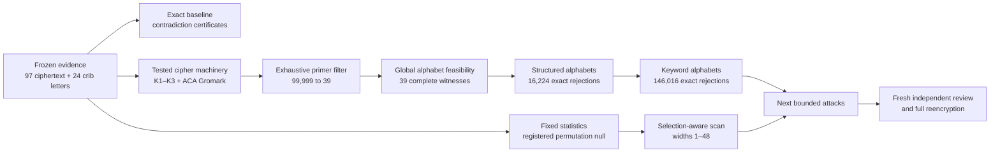

# kryptos-research

Reproducible evidence, cipher tooling, exact constraints, and bounded statistical
experiments for the 97-letter Kryptos K4 ciphertext. The repository implements
the staged program in the [K4 agent plan](docs/kryptos-k4-agent-plan.md) and
preserves the inputs and outputs needed to audit each result.

**This project has not solved K4.** It has completed eight engineering and
reproduction milestones. The newest result exactly rejects all **146,016**
registered combinations of 39 primers, 12 keyword-derived alphabet orders,
ordered plaintext/ciphertext pairs, and relative rotations after a complete
full-message recovery calibration gate. This excludes that finite model family. It does not
identify the intended alphabets, plaintext, key, or historical procedure.

## Current results

| Milestone | Stage | Result | Main record |
| --- | --- | --- | --- |
| 1 | Evidence and exact baseline | Froze the 97 letters and 24 crib letters; produced scoped contradiction certificates for pure transposition, fixed substitution, fixed-point bans, and repeating A–Z Vigenère periods | [Report](reports/milestone-1.md) |
| 2 | Cipher foundations | Reproduced K1, both K2 variants, K3's explicit permutation, and the ACA Gromark example in Rust and an independent Python implementation | [Report](reports/milestone-2.md) |
| 3 | Decimal-primer filter | Exhaustively reproduced **99,999 → 1,040 → 39** primers with Rust, Python, and pinned upstream C | [Report](reports/milestone-3.md) |
| 4 | Fixed statistical tests | Reproduced five historical statistics with a 10,000-sample pilot and a fresh 1,000,000-permutation precision run | [Report](reports/milestone-4.md) |
| 5 | Selection-aware width scan | Repeated the complete width 1–48 selection on every null text; width 21 won, with 441/100,000 global exceedances and adjusted estimate **0.004419956** | [Report](reports/milestone-5.md) |
| 6 | Global alphabet feasibility | Solved both alphabets' all-different constraints for every one of the 39 primers; **39 feasible, 0 infeasible, 0 unresolved** | [Report](reports/milestone-6.md) |
| 7 | Structured alphabet exclusion | Evaluated **389,376** equations across 16,224 canonical fixed-order models; **16,224 rejected, 0 survivors** | [Report](reports/milestone-7.md) |
| 8 | Keyword alphabet exclusion | Recovered and reencrypted 144 planted messages through decoded candidate IDs, then evaluated **3,504,384** K4 equations; **146,016 rejected, 0 survivors** | [Report](reports/milestone-8.md) |

The width result is conditional on the registered statistic, width range,
calibration, and multiset-permutation null. It does not correct every historical
pattern search. The feasibility result uses arbitrary independent alphabet
permutations, so its witness alphabets have no claim to being meaningful words
or historical keys.

## How the research stages fit together

The project separates evidence, implementation, experiments, and interpretation.
That separation prevents a promising output from silently changing its input
data or expanding the scope of a claim.



The longer research plan has the following phases:

1. **Evidence audit.** Freeze the K4 transcription, zero-based crib positions,
   source ledger, statement provenance, and current-status gaps. A changed
   transcription invalidates dependent runs.
2. **Cryptanalytic foundations.** Implement explicit alphabets, modular
   equations, recurrence keys, substitutions, permutations, ragged columnar
   transposition, position traces, and known-answer fixtures.
3. **Exact exclusions.** Use small contradiction witnesses before expensive
   search. A model can be excluded only within its stated domain; a surviving
   necessary condition is not a solution.
4. **Statistical diagnosis.** Register statistics, null ensembles, seeds,
   selection rules, and precision decisions before simulation. Preserve raw
   counts and uncertainty rather than reporting an unexplained score.
5. **Bounded attacks.** Investigate structured key schedules, recurrences,
   documentary running keys, and compound substitution/transposition models.
   Milestones 3, 6, 7, and 8 cover one narrow recurrence branch of this phase.
6. **Candidate validation.** A serious candidate must explain all 97 letters,
   reencrypt exactly, derive its key independently of the proposed plaintext,
   recover planted examples under the same attack, and survive a fresh
   implementation review.

Milestones are reviewable work packages within these phases. Completing a
milestone does not imply that every gate in its surrounding phase is complete.

## Quick start

The crate requires Rust 1.85 or newer. Recorded runs use Rust 1.95.0 and Python
3.14.4 on Linux. Python 3.10 or newer is recommended. Dependencies are pinned
in `Cargo.lock`; the experiment runners build with `--locked --offline` after
the initial dependency download.

```bash
git clone <repository-url>
cd kryptos-research
cargo build --locked
cargo run --locked -- --help
cargo run --locked -- validate
cargo run --locked -- diagnose > /tmp/k4-diagnosis.json
```

Useful commands:

| Command | Purpose | Input behavior |
| --- | --- | --- |
| `validate [EVIDENCE.json]` | Validate the ciphertext, lines, transcriptions, anchors, and source references | Defaults to `evidence/k4.json` |
| `diagnose [EVIDENCE.json]` | Emit exact baseline checks and contradiction witnesses | Defaults to `evidence/k4.json` |
| `transform REQUEST.json` | Run declared cipher pipelines with full position traces | Explicit request required |
| `primers [EVIDENCE.json]` | Exhaustively filter all 99,999 nonzero decimal five-digit primers | Defaults to `evidence/k4.json` |
| `statistics REQUEST.json` | Simulate the five fixed statistics under the registered permutation mechanism | Explicit request required |
| `width-scan REQUEST.json` | Calibrate and evaluate the width 1–48 maximum statistic | Explicit request required |
| `feasibility REQUEST.json` | Find complete two-alphabet witnesses or exact infeasibility decisions for supplied primers | Explicit request required |
| `structured-alphabets REQUEST.json` | Exhaust named alphabet pairs and relative rotations with rejection certificates | Explicit request required |
| `keyword-calibrate REQUEST.json` | Census keyword-model signatures and run all 144 deterministic planted cases | Explicit request required |
| `keyword-alphabets REQUEST.json CALIBRATION.json` | Exhaust the registered K4 keyword family after exact calibration regeneration | Explicit request and passing calibration required |

For example:

```bash
cargo run --release --locked -- transform fixtures/example-request.json
cargo run --release --locked -- primers > /tmp/k4-primers.json
cargo run --release --locked -- statistics fixtures/statistics-example.json > /tmp/k4-statistics.json
cargo run --release --locked -- width-scan fixtures/width-scan-example.json > /tmp/k4-widths.json
cargo run --release --locked -- feasibility fixtures/feasibility-request.json > /tmp/k4-feasibility.json
cargo run --release --locked -- structured-alphabets fixtures/structured-alphabets-request.json > /tmp/k4-structured.json
cargo run --release --locked -- keyword-calibrate fixtures/keyword-alphabets-request.json > /tmp/k4-keyword-calibration.json
cargo run --release --locked -- keyword-alphabets fixtures/keyword-alphabets-request.json /tmp/k4-keyword-calibration.json > /tmp/k4-keywords.json
python3 verification/verify_feasibility.py \
  --request fixtures/feasibility-request.json \
  --report /tmp/k4-feasibility.json
python3 verification/verify_structured_alphabets.py \
  --request fixtures/structured-alphabets-request.json \
  --report /tmp/k4-structured.json
python3 verification/verify_keyword_alphabets.py \
  --request fixtures/keyword-alphabets-request.json \
  --calibration /tmp/k4-keyword-calibration.json \
  --report /tmp/k4-keywords.json
```

Commands write machine-readable results to stdout and errors to stderr. They
reject unknown JSON fields and malformed input rather than normalizing it. Text
inputs must already be uppercase ASCII where the schema requires text.

## Reproducing the milestones

Experiment specifications are registered JSON documents under `experiments/`.
Each runner requires a **new** directory beneath `results/`; it refuses to
overwrite an existing run. The preserved runs below are the records cited by
the milestone reports.

| Work package | Reproduction command using a new directory | Preserved run |
| --- | --- | --- |
| Baseline | `python3 experiments/run_baseline.py results/K4-D-0001/run-002` | [`run-001`](results/K4-D-0001/run-001/completion.json) |
| Cipher foundations | `python3 experiments/run_foundations.py results/FOUNDATIONS-0001/run-003` | [`run-002`](results/FOUNDATIONS-0001/run-002/completion.json) |
| Primer filter | `python3 experiments/run_primers.py results/PRIMERS-0001/run-003` | [`run-002`](results/PRIMERS-0001/run-002/completion.json) |
| Fixed-statistic precision | `python3 experiments/run_statistics.py experiments/STATS-0002.json results/STATS-0002/run-003` | [`run-002`](results/STATS-0002/run-002/completion.json) |
| Width-scan precision | `python3 experiments/run_width_scan.py experiments/WIDTHS-0002.json results/WIDTHS-0002/run-002` | [`run-001`](results/WIDTHS-0002/run-001/completion.json) |
| Alphabet feasibility | `python3 experiments/run_feasibility.py results/FEASIBILITY-0001/run-002` | [`run-001`](results/FEASIBILITY-0001/run-001/completion.json) |
| Structured alphabets | `python3 experiments/run_structured_alphabets.py results/STRUCTURED-ALPHABETS-0001/run-003` | [`run-002`](results/STRUCTURED-ALPHABETS-0001/run-002/completion.json) |
| Keyword alphabets | `python3 experiments/run_keyword_alphabets_v2.py results/KEYWORD-ALPHABETS-0002/run-002` | [`0002/run-001`](results/KEYWORD-ALPHABETS-0002/run-001/completion.json) |

Check the frozen evidence and fixture sets before reproducing earlier work:

```bash
sha256sum --check evidence/SHA256SUMS
sha256sum --check fixtures/SHA256SUMS
```

The runners record:

- hashes of frozen evidence, specifications, source code, requests, binaries,
  and outputs;
- tool versions, commands, exit statuses, elapsed time, and child-process peak
  memory where the platform exposes it;
- declared wall-time and evaluation caps;
- deterministic seeds and random-generator definitions when sampling is used;
- completion, failure, timeout, and interruption events in the append-only
  [experiment registry](experiments/registry.jsonl).

Failed and interrupted runs remain part of the record. `budget_exhausted`,
`solver_unknown`, `no_candidate_found`, and `infeasible` are distinct outcomes.
The coordinators should be run sequentially because concurrent registry writes
are outside the current design.

## What each implementation checks

### Evidence and baseline diagnostics

[`evidence/k4.json`](evidence/k4.json) contains the normalized 97-letter
ciphertext, physical line fragments, and four half-open crib ranges. The
preceding sculpture question mark is outside this baseline. The source and
statement ledgers retain provenance and uncertainty.

The baseline establishes only the following aligned facts:

- pure transposition of exactly these 97 letters cannot supply the anchor
  multiplicities;
- one fixed monoalphabetic encryption or decryption function conflicts with
  the anchors;
- a direct rule forbidding every self-encryption conflicts at human positions
  33 and 74;
- 49 of the 97 ordinary A–Z repeating-Vigenère periods fail a necessary key
  consistency test; periods 27–29 and 53–97 survive it;
- the ciphertext index of coincidence is exactly `336 / 9312`.

These results do not exclude transposition inside a compound cipher, other
alphabets, other sign conventions, or a long unconstrained key.

### Cipher machinery

The Rust library provides typed alphabet maps, Vigenère/Beaufort/variant
Beaufort equations, Gromark recurrence streams, ragged permutations, constraint
transport, composition, and reversible traces. Published fixtures are checked
in both directions. Seeded synthetic cases vary text length, keys, alphabets,
offsets, and routes. A separate Python implementation checks expected text and
every trace field; round trips alone are not treated as sufficient evidence.

The exact conventions live in [cipher-conventions.md](docs/cipher-conventions.md).

### Primer filtering and complete alphabets

The primer model is

```text
k[i] = (k[i-5] + k[i-4]) mod 10
c(C_i) - p(P_i) = k[i] mod 26
```

where `p` and `c` are independent alphabet permutations. Milestone 3 turns the
24 crib equations into a bipartite letter graph. Pair, cycle, and within-component
collision constraints reduce the complete nonzero five-digit domain to 39
primers and preserve a certificate for every rejection.

Milestone 6 closes the necessary-versus-sufficient gap for those survivors.
Each graph component has one free translation. The exact solver packs component
footprints into both 26-position alphabets, fixes only a proven common-rotation
symmetry, and emits two complete permutations plus all 24 evaluated equations.
An independent Python solver derives the graph again and searches offsets in a
different order. Every registered primer is feasible; the broad alphabet model
therefore does not reduce the list below 39.

See [primer conventions](docs/primer-conventions.md) and
[feasibility conventions](docs/feasibility-conventions.md).

### Structured alphabet restriction

Milestone 7 replaces the arbitrary permutations with four explicit orders:
A-Z and the KRYPTOS-deduplicated alphabet, each forward and reversed. Every
ordered plaintext/ciphertext pair and every relative rotation is checked for
each of the 39 primers. All 16,224 models fail at least one crib equation; every
failure has a true first-mismatch certificate. The independent verifier
reconstructs the full domain and all 389,376 equations.

The best models match 6 of 24 cribs, with 12 tied models. That descriptive score
was not used to tune or extend the domain. The exact scope and the disclosed
pre-registration zero-rotation probe are recorded in
[structured alphabet conventions](docs/structured-alphabet-conventions.md).

### Keyword alphabet restriction

Milestone 8 expands the fixed family with the sourced words `KRYPTOS`,
`PALIMPSEST`, and `ABSCISSA`. For each word it constructs the ordinary
deduplicated keyword-fill alphabet and the ACA Gromark transposed alphabet,
then includes each order forward and reversed. `PALIMPSEST` and `ABSCISSA` are
K1/K2 indicators repurposed as explicit K4 hypotheses; that reuse is not a
historical claim. `ENIGMA` remains a construction known-answer control only.

The resulting 12 distinct rotation classes produce 146,016 physical models.
Before K4 evaluation, the implementation censuses every 24-letter crib
signature and runs one deterministic full-message planted case for each of the
144 ordered base-order pairs. All 144 true models were retained and all 144
messages were recovered by decoding their retained physical candidate IDs,
decrypting all 97 positions through a separate inverse path, and reencrypting
the recovered plaintext; 98 recovery sets were singletons. The gated K4 run
then rejected every model after checking 3,504,384 equations. Seven models tied
at the descriptive maximum of 7/24 matches. No score was used to expand or tune
the frozen domain.

The original `KEYWORD-ALPHABETS-0001/run-001` had already observed that K4
result, but its forward-only reencryption check was tautological and its cap
omitted inverse and final forward work. It remains an immutable **superseded**
record. `KEYWORD-ALPHABETS-0002` is an explicitly unblinded amendment with
correct inverse recovery, exact operation counters, and a current-binary
foundations regression.

The scope, deterministic generator, canonical indexing, disclosed structural
probe, operation cap, and exclusions are frozen in
[amended keyword alphabet conventions](docs/keyword-alphabet-conventions-v2.md). The
independent Python implementation regenerates the full calibration report,
compact K4 certificate arrays, score histogram, and any survivor traces.

### Statistical experiments

The fixed experiment measures five declared statistics on random permutations,
with replacement, of K4's observed letter multiset. It preserves dense
histograms, exceedance counts, `(r+1)/(N+1)` estimates, Wilson intervals, and a
five-test Bonferroni correction. The precision run uses a fresh seed and does
not pool the pilot.

The width experiment separately calibrates each width from 1 through 48, then
selects the maximum standardized score for K4 and for every evaluation
permutation. Exact signed integer comparisons avoid floating-point rank changes.
This accounts for choosing the best registered width for this statistic; it
does not account for unrelated statistics, alphabets, crib subsets, or earlier
human exploration.

See [statistical conventions](docs/statistics-conventions.md) and
[width-scan conventions](docs/width-scan-conventions.md).

## Project organization

| Path | Responsibility |
| --- | --- |
| `evidence/` | Frozen K4 data, physical rendering, source ledger, attributed statements, reference material, and checksums |
| `fixtures/` | Known-answer vectors and small explicit requests used by the CLI and tests |
| `src/cipher/` | Alphabet, polyalphabetic, recurrence, constraint, and permutation primitives |
| `src/evidence.rs` | Strict evidence parsing and validation |
| `src/diagnosis.rs` | Pure baseline calculations and contradiction certificates |
| `src/primers.rs` | Exhaustive primer filtering and symbolic rejection relations |
| `src/feasibility/` | Graph coordinates, bounded component-offset search, witness completion, and batch reporting |
| `src/structured_alphabets/` | Pure fixed-order equation evaluation, strict finite-domain validation, and rejection certificates |
| `src/keyword_alphabets/` | Keyword constructors, canonical model indexing, signature census, planted calibration gate, and compact exhaustive K4 certificates |
| `src/statistics/` | Fixed measurements, deterministic sampling, histograms, and selection-aware width scans |
| `src/transforms.rs` | Request-driven cipher-pipeline execution and position traces |
| `src/cli.rs` | Thin filesystem, argument, JSON, and terminal adapter |
| `verification/` | Python reference algorithms, artifact verifiers, and tamper tests |
| `experiments/` | Preregistered specifications, bounded runners, and append-only run registry |
| `results/` | Immutable per-run manifests, reports, logs, hashes, and completion records |
| `reports/` | Human-readable milestone findings, limits, validation, prior work, and current status |
| `docs/` | Full research plan and frozen model/convention documents |
| `third_party/` | Pinned upstream comparison source, kept separate with its original license |

The Rust design keeps core calculations separate from I/O. `main.rs` delegates
to the CLI, the CLI parses files, and library modules accept typed values and
return explicit results. Python verifiers do not call into the Rust library.
The upstream Bean C program is compiled and executed as a separate comparison
process; it is not linked into this MIT-licensed crate.

## Validation

Run the complete local checks from the repository root:

```bash
cargo fmt --all -- --check
cargo clippy --all-targets --all-features -- -D warnings -W clippy::pedantic
cargo test --all-features
cargo test --doc
RUSTDOCFLAGS="-D warnings" cargo doc --all-features --no-deps
python3 -m unittest discover -s verification -v
```

The suites cover malformed schemas and text, empty and boundary inputs,
known-answer ciphers, planted schedules and alphabets, recurrence expansion,
graph contradictions, exhaustive/incomplete feasibility outcomes, deterministic
random streams, histogram totals, exact score ties, CLI failures, and deliberately
corrupted artifacts. Tests require no network access. Generated Rust API docs
are available at `target/doc/kryptos_research/index.html`.

Linux is the validated platform. The Rust CLI uses portable paths and the Python
code uses the standard library, but Windows and macOS runs have not yet been
validated. The pinned upstream comparison requires a GNU-compatible C compiler.
`cargo audit`, `cargo deny`, and `cargo nextest` are not configured project gates.

## Extending the project

Read [AGENTS.md](AGENTS.md) before changing code. For a new experiment:

1. State the exact model, domain, exclusions, success criterion, evaluation cap,
   wall-time cap, and falsification condition.
2. Freeze input hashes and conventions in a new experiment specification before
   inspecting its results.
3. Keep parsing and I/O thin; put testable calculations in focused library
   functions with explicit errors.
4. Add meaningful Rust tests and an independently derived verifier where the
   result supports a research claim.
5. Write to a new results directory, retain failures, and report actual coverage
   and uncertainty.
6. Update the relevant convention document, milestone report, research-plan
   implementation record, and this README.

The next useful work should preregister a distinct documented tableau
construction or structured key schedule, with planted recovery calibration and
an exact finite domain. Open plan items also include broader registered
statistical batteries and nulls, unresolved source access, and a fresh-context
A7 verification dossier.

## License

Project code is [MIT licensed](LICENSE). The vendored Bean comparison source
retains its [GPL-3.0 license](third_party/bean-k4testing/LICENSE). Linked source
material remains the property of its authors; this repository does not grant a
license over those works.
