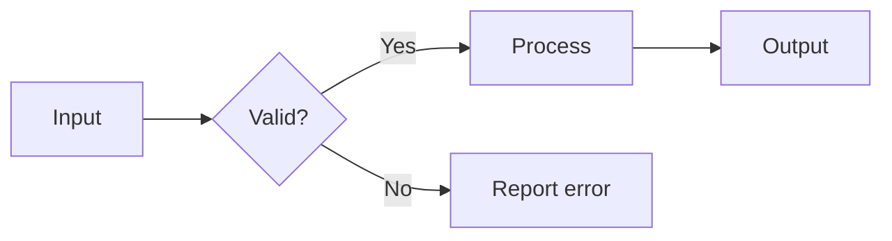

# STYLE.md

This file defines engineering and documentation conventions for human
contributors and coding agents. Follow the
[general software guidelines](#general-software-guidelines) for all project code
and documentation, then the additional
[Rust-specific rules](#rust-specific-rules) for Rust code. Agent workflow, review
gates, and required validation commands are in
[AGENTS.md](AGENTS.md).

## Contents

- [General software guidelines](#general-software-guidelines)
  - [Engineering priorities](#engineering-priorities)
  - [Maintainable design](#maintainable-design)
  - [Functions and external systems](#functions-and-external-systems)
  - [Testing and edge cases](#testing-and-edge-cases)
    - [Edge case discipline](#edge-case-discipline)
  - [Error handling](#error-handling)
  - [Dependency management](#dependency-management)
  - [Performance](#performance)
  - [Portability and embedded targets](#portability-and-embedded-targets)
  - [Logging and observability](#logging-and-observability)
  - [Command-line behavior](#command-line-behavior)
  - [Documentation](#documentation)
    - [Mermaid diagrams](#mermaid-diagrams)
    - [Mathematical notation](#mathematical-notation)
    - [README](#readme)
- [Rust-specific rules](#rust-specific-rules)
  - [Rust style and idioms](#rust-style-and-idioms)
  - [Public API design](#public-api-design)
  - [Module organization](#module-organization)
  - [Rust tests](#rust-tests)
  - [Rust documentation](#rust-documentation)
    - [Recommended documentation structure](#recommended-documentation-structure)
    - [Documentation hyperlinks](#documentation-hyperlinks)
  - [Examples and doctests](#examples-and-doctests)
  - [Formatting and Clippy](#formatting-and-clippy)
  - [Crates and security tooling](#crates-and-security-tooling)
  - [Unsafe Rust](#unsafe-rust)

## General software guidelines

These guidelines apply across the repository, including Rust, Python, and
project documentation.

### Engineering priorities

Use these priorities for software in this repository, in this order:

1. Correctness
2. Maintainability
3. Safety
4. Testability
5. Readability
6. Idiomatic use of the implementation language
7. Performance, where justified by requirements or measurement

Prefer simple, explicit designs over clever abstractions. Avoid unnecessary
complexity, hidden behavior, and premature optimization.
Use clear, descriptive names for modules, types, functions, variables, and errors.

Code should be structured so that future maintainers can quickly understand:

- What the code does
- Why it exists
- What assumptions it makes
- How failures are handled
- How to test it
- How to safely change it

### Maintainable design

Maintainability is a high priority for this repository.

Organize code so responsibilities are separated where appropriate. Avoid large
modules, large functions, and types that do too many things.

Preferred structure:

- Separate domain logic from I/O.
- Separate parsing from validation.
- Separate configuration from execution.
- Separate business rules from presentation or terminal/UI code.
- Separate pure logic from filesystem, network, process, or hardware interactions.
- Use narrow abstractions for external dependencies when they improve testability or modularity.
- Keep public APIs small, intentional, and documented.

Avoid designs where one type or module is responsible for everything.

When appropriate, follow SOLID principles:

- **Single Responsibility Principle:** Each module, type, and function should
  have a clear reason to change.
- **Open/Closed Principle:** Prefer designs that allow extension without invasive modification.
- **Liskov Substitution Principle:** Implementations should behave consistently
  with their interface's expectations.
- **Interface Segregation Principle:** Keep interfaces focused and avoid forcing
  implementers to support unrelated behavior.
- **Dependency Inversion Principle:** Depend on abstractions where they improve
  modularity, testing, or portability.

Use these principles when they clarify the design; avoid object-oriented
ceremony that makes code harder to understand.

### Functions and external systems

Every function should be designed to be unit testable unless there is a strong reason it cannot be.

Functions should:

- Have a single clear responsibility.
- Accept inputs explicitly instead of relying on hidden state.
- Return outputs explicitly.
- Avoid unnecessary side effects.
- Prefer pure functions for core logic.
- Use dependency injection for external systems when practical.
- Be small enough that all branches and edge cases can be understood and tested.
- Avoid global mutable state and hidden side effects.

Functions that interact with external systems should be thin wrappers around testable core logic.

Examples of external systems include:

- Filesystems
- Network services
- Environment variables
- System clocks
- Random number generators
- Databases
- Shell commands
- Hardware registers
- Embedded devices
- Operating system APIs

### Testing and edge cases

Functions should have unit tests unless they are trivial, generated, or only
delegate directly to already-tested behavior.

Tests must cover:

- Normal cases
- Boundary conditions
- Edge cases
- Error cases
- Empty inputs
- Invalid inputs
- Large or unusual inputs where relevant
- All meaningful branches
- Regression cases for fixed bugs

Testing expectations:

- Unit tests should be close to the code they test.
- Integration tests should be used for public API behavior and cross-module workflows.
- Tests should be deterministic.
- Tests should not depend on external network access.
- Tests should avoid real filesystem usage unless filesystem behavior is the subject under test.
- Prefer temporary directories/files for filesystem tests.
- Use mocks, fakes, fixtures, or narrow interfaces to isolate external dependencies.
- Test names should clearly describe the behavior being verified.
- Make only one assertion per unit test where possible.

Avoid tests that merely execute code without meaningful assertions.

#### Edge case discipline

When adding or modifying logic, explicitly consider:

- Minimum values
- Maximum values
- Empty collections
- Single-item collections
- Duplicate values
- Invalid enum/string values
- Malformed input
- Permission errors
- Missing files
- Non-UTF-8 input where relevant
- Integer overflow or underflow
- Floating-point precision issues where relevant
- Platform-specific behavior

### Error handling

Errors must be explicit, meaningful, and actionable.

Preferred practices:

- Use domain-specific error types for structured cases that callers need to distinguish.
- Preserve source errors where helpful.
- Include enough context to diagnose failures.
- Do not silently ignore errors.
- Do not panic for recoverable failures.
- Avoid broad catch-all errors when callers can reasonably respond to specific cases.

Library code should generally return errors instead of exiting the process.

Application binaries may decide how to report errors to the user, but the
underlying logic should remain testable and reusable.

### Dependency management

Dependencies must be justified.

Before adding a dependency, consider:

- Is it necessary?
- Is it actively maintained?
- Is its license acceptable?
- Does it introduce security risk?
- Does it substantially increase compile time or binary size?
- Can the standard library solve the problem clearly?

Prefer well-maintained, widely used libraries for common functionality.

Do not add dependencies casually.

### Performance

Performance-sensitive code should be written clearly first and optimized based on evidence.

When optimizing:

- Measure before and after.
- Prefer algorithmic improvements over micro-optimizations.
- Avoid unnecessary allocation.
- Document non-obvious performance decisions.
- Add benchmarks when performance is a requirement.
- Avoid sacrificing correctness or maintainability for unmeasured speed.

Use appropriate tools such as benchmarks, profiling, and targeted tests when performance matters.

### Portability and embedded targets

When code may run on multiple platforms or targets, platform-specific behavior must be explicit.

Consider and document:

- Linux vs Windows behavior
- Filesystem path differences
- Line ending differences
- Executable permission bits
- Target architecture assumptions
- Endianness, where relevant
- Cross-compilation linker requirements
- Environment variables used by builds or tools
- Availability of system commands
- Embedded Linux constraints
- Hardware access assumptions

Platform-specific code should be isolated behind narrow abstractions where practical.

### Logging and observability

Applications should provide useful diagnostics without excessive noise.

Logging should:

- Include useful context.
- Avoid leaking secrets.
- Distinguish user-facing errors from developer diagnostics.
- Be structured consistently.
- Be testable where practical.

Libraries should generally not configure global logging. Binaries may configure logging at startup.

### Command-line behavior

For command-line applications:

- Provide clear help text.
- Use meaningful exit codes.
- Print actionable errors.
- Avoid panics for user input mistakes.
- Validate arguments early.
- Keep terminal output readable.
- Support scripting-friendly output when appropriate.

CLI behavior should be tested with integration tests when practical.

### Documentation

Keep documentation accurate as behavior changes. Explain the purpose, important
assumptions, and failure behavior of features that future maintainers will need
to understand.

#### Mermaid diagrams

Represent project architecture, major workflows, data flows, and other useful
relationships with Mermaid diagrams in the relevant Markdown documentation.
Use a `mermaid` fenced code block so the diagram remains editable alongside
the text. Choose a flowchart, sequence diagram, or state diagram that matches
the relationship being explained.

Label components and transitions clearly, including direction and important
decision points. Keep each diagram focused enough to read without zooming.
Explain its purpose and any important assumptions in nearby prose so the
documentation remains useful when the diagram is not rendered. Update affected
diagrams whenever the architecture or workflow changes, and check that they
render correctly before considering the documentation complete.

For example, this diagram shows a generic input-validation workflow:



#### Mathematical notation

When adding or editing mathematical equations in the README, research documents,
reports, or Rust API documentation, write them in LaTeX notation. Use `$...$`
for inline equations and `$$` on separate lines for displayed equations in
Markdown. For example:

$$
k_i = (k_{i-5} + k_{i-4}) \bmod 10,
\qquad
c(C_i) - p(P_i) \equiv k_i \pmod{26}.
$$

Here $i$ is a zero-based position, $k_i$ is a generated decimal digit,
$P_i$ and $C_i$ are plaintext and ciphertext letters, and $p$ and $c$ map
letters to positions in their respective alphabets.

Define symbols, indexing conventions, domains, and units near each equation.
Distinguish exact equalities from congruences and estimates. Use LaTeX notation
for equations rather than ASCII formulas in prose or code spans. Code blocks
remain appropriate for executable examples, JSON fields, commands, and literal
output. When a documentation renderer does not typeset mathematics, keep the
LaTeX source readable and explain the equation in words.

#### README

Update `README.md` when behavior, usage, configuration, dependencies, public
APIs, build steps, testing instructions, or release procedures change.

The README should be treated as part of the product, not as an afterthought.

A professional README should include, where applicable:

- Project name
- Purpose and summary
- Key features
- Current status or maturity
- Installation instructions
- Build instructions
- Usage examples
- CLI examples, if applicable
- Configuration instructions
- Testing instructions
- Documentation generation instructions
- Supported platforms or targets
- Cross-compilation notes, if applicable
- Security considerations
- Error handling expectations
- Project layout
- Contribution guidelines
- License information

README examples must be kept accurate and tested where practical.

## Rust-specific rules

Apply these rules in addition to the general guidelines when writing Rust.
Follow established Rust idioms in general. Use the official
[Rust Style Guide](https://doc.rust-lang.org/style-guide/) for formatting and the
Rust library team's [Rust API Guidelines](https://rust-lang.github.io/api-guidelines/)
for public API design. The rules below specify this project's additional
expectations.

### Rust style and idioms

All Rust code must be idiomatic and follow established Rust conventions.

Required practices:

- Prefer strong types over loosely typed primitives when they improve correctness or clarity.
- Prefer `Result<T, E>` for recoverable errors.
- Avoid `unwrap`, `expect`, and panicking behavior outside of tests unless a
  documented invariant makes failure impossible or unrecoverable.
- Prefer borrowing over cloning when practical and clear.
- Use pattern matching idiomatically.
- Prefer iterator adapters when they improve readability, but use explicit loops when they are clearer.
- Make invalid states unrepresentable where practical.
- Prefer compile-time guarantees over runtime checks where reasonable.

Do not write Rust that merely imitates C, C++, C#, Java, or Python patterns. Use
Rust's ownership model, type system, traits, enums, pattern matching, and error
handling intentionally.

### Public API design

Public APIs should be minimal, intentional, and stable.

Before exposing an item publicly, consider:

- Does external code need this?
- Can this remain private?
- Is the name clear?
- Is the behavior documented?
- Are errors documented?
- Can this be tested independently?
- Will this API be painful to support later?

Prefer making items private until there is a clear need to expose them.

For library crates, avoid unnecessary breaking changes. Document required
breaking changes clearly.

### Module organization

Modules should be organized around cohesive responsibilities.

Preferred patterns:

- Organize reusable logic into dedicated modules instead of concentrating implementation in `main.rs`.
- Keep `main.rs` as a thin entrypoint that delegates to module/library code for orchestration.
- `config` for configuration types and loading
- `error` for error types
- `parser` or `parse` for parsing logic
- `runner` or `app` for orchestration
- `io` or more specific names for filesystem or external interaction
- `domain` or feature-specific modules for core business logic
- `tests` or integration test directories for cross-cutting behavior

Avoid dumping unrelated code into `utils`, `common`, or `misc` modules. Name a
helper module after the concept it supports.

### Rust tests

Put unit tests near the code they exercise, usually in a `#[cfg(test)]` module.
Keep test names descriptive. Run the Rust suite with `cargo test --all-features`.

Example test naming style:

```rust
#[test]
fn parse_config_returns_error_when_required_field_is_missing() {
    // ...
}
```

### Rust documentation

Documentation is mandatory for public APIs and strongly encouraged for important private items.

Public documentation must be professional, clear, and useful to a developer
reading generated `cargo doc` output.

Use Rust doc comments:

```rust
/// Short summary sentence.
///
/// Additional details explaining behavior, assumptions, and usage.
```

Documentation should include applicable sections from this list:

- Summary
- Detailed description
- Arguments or parameters
- Returns
- Errors
- Panics
- Safety
- Examples
- Notes
- See also
- Performance considerations
- Platform-specific behavior

Use only the sections that apply. Do not add meaningless boilerplate sections.

#### Recommended documentation structure

For public functions, methods, traits, structs, enums, and modules, use a
structure similar to the following when applicable:

```rust
/// Briefly explains what this item does.
///
/// Provides additional context, including important behavior, assumptions,
/// invariants, and when this item should be used.
///
/// # Parameters
///
/// - `input`: Describes the input and any constraints.
/// - `options`: Describes configuration or behavior changes.
///
/// # Returns
///
/// Describes the returned value and what it represents.
///
/// # Errors
///
/// Returns an error when:
///
/// - The input is invalid.
/// - Required data is missing.
/// - The underlying operation fails.
///
/// # Panics
///
/// Panics only if a documented invariant is violated.
///
/// # Examples
///
/// ```rust
/// # use crate_name::example_function;
/// let result = example_function("value")?;
/// assert_eq!(result, "expected");
/// # Ok::<(), crate_name::Error>(())
/// ```
///
/// # See also
///
/// - [`RelatedType`]
/// - [`related_function`]
/// - [`crate::module::OtherItem`]
pub fn example_function(input: &str) -> Result<String, Error> {
    // ...
}
```

#### Documentation hyperlinks

Documentation should use intra-doc links to connect related parts of the codebase.

Use links such as:

```rust
/// Creates a [`Config`] from a [`ConfigSource`].
///
/// Use [`Config::validate`] to check the resulting configuration before passing
/// it to [`Runner::run`].
```

Prefer links to:

- Related structs
- Related enums
- Related traits
- Important constructors
- Validation methods
- Error types
- Configuration types
- Higher-level workflows
- Lower-level helper APIs when useful

All intra-doc links must resolve successfully under `cargo doc`.

### Examples and doctests

Public APIs should include examples when practical.

Examples should:

- Compile as doctests where possible.
- Demonstrate realistic usage.
- Be minimal but meaningful.
- Show error handling when relevant.
- Avoid relying on external resources.
- Use hidden setup lines when needed to keep examples readable.

Run documentation tests as part of normal validation:

```bash
cargo test --doc
```

If a public API cannot reasonably include a doctest, include a clear usage explanation instead.

### Formatting and Clippy

Rust code must pass:

```bash
cargo fmt --all -- --check
cargo clippy --all-targets --all-features -- -D warnings -W clippy::pedantic
```

Clippy pedantic compliance is required.

If a `clippy::pedantic` lint must be allowed, the allow must be:

- As narrow as possible
- Placed at the smallest reasonable scope
- Accompanied by a clear comment explaining why the lint is intentionally allowed

Example:

```rust
#[allow(clippy::module_name_repetitions)]
// The repeated module name improves public API clarity for downstream users.
pub struct ParserConfig {
    // ...
}
```

Do not suppress lints casually.

### Crates and security tooling

Prefer well-maintained, widely used crates for common functionality.

When security tooling is configured, the codebase should remain compatible with tools such as:

```bash
cargo audit
cargo deny check
cargo nextest run
```

### Unsafe Rust

Unsafe Rust is discouraged unless it is necessary and justified.

If `unsafe` is required:

- Keep the unsafe block as small as possible.
- Document the safety invariants in a `# Safety` section.
- Explain why safe Rust cannot reasonably solve the problem.
- Encapsulate unsafe behavior behind a safe API when possible.
- Add tests that exercise the safe wrapper.
- Consider using Miri or other tools where applicable.

Every unsafe block must have a clear safety comment.

Example:

```rust
// SAFETY: `ptr` is checked for null above, is aligned for `u32`, and points to
// initialized memory owned by the caller for the duration of this function.
let value = unsafe { ptr.read_volatile() };
```
