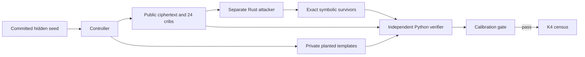

# Classical schedule conventions

Milestone 11 uses the standard alphabet $A=0,\ldots,Z=25$, direct aligned
positions, and no route. Positions are zero based. Its finite domain contains
repeating periods 1–32; progressive schedules

$$k_i=q_{i\bmod t}+\lfloor i/t\rfloor d\pmod{26};$$

plaintext and ciphertext autokey with seed lengths 1–32 under all three
Vigenère equations; and repeating schedules reset at at most two of positions
4, 35, and 66. A reset starts a new key coordinate zero at that position.

The raw count is

$$3(32)+3(32)(26)(26)+2(3)(32)+3(32)(7)=65{,}856.$$

Vigenère and variant Beaufort free streams differ only by key negation. Phase
renames free coordinates, progressive origin is absorbed into the seed, and
progressive increment zero duplicates a repeating stream. Deduplicating the
224 period/reset descriptions on the 97 message positions gives 200 coordinate
maps. The canonical census therefore contains 400 coordinate-map/equation
templates, 1,600 nonzero-progressive templates, and 192 autokey templates:
2,192 total. Autokey equations are retained separately because feedback makes
their recurrences distinct.

Known letters constrain seed residues symbolically. A template with $f$ free
seed coordinates denotes $26^f$ concrete streams and remains a survivor. Its
saved witness assigns zero to each free coordinate and decrypts all 97 letters;
the witness is an audit device, not a proposed plaintext. Counts refer to
templates, never to a union of every represented concrete stream.

The calibration has 120 deterministic positive cases spanning all family and
boundary classes and 40 crib-tamper negatives. It explicitly exercises phases
0 and $t-1$, origins 0 and 25, increments 1 and 25, both free-stream signs,
all seven reset subsets, and the increment-zero raw alias of a repeating
schedule. Alias cases are scored against their canonical template. The attacker sees ciphertext and
24 aligned letters only. Its seed commitment is frozen before generation; the
private truth stays outside the run directory until the attacker exits. An
independent Python implementation regenerates cases, enumerates exact survivor
sets and order, and checks every witness by reencryption. K4 evaluation is
permitted only after all 120 planted templates survive, all 40 tampered cases
exclude their planted template, boundary coverage is complete, and there are
zero unknown cases.

The scientific cap is 100,000,000 elementary registered operations, with at
most 283,856 per case, 45,416,960 across calibration, 3,600 seconds of wall
time, and zero external spend. The implementation also reports the narrower
canonical-template-check count: 350,720 for 160 calibration cases and 2,192
for K4.

