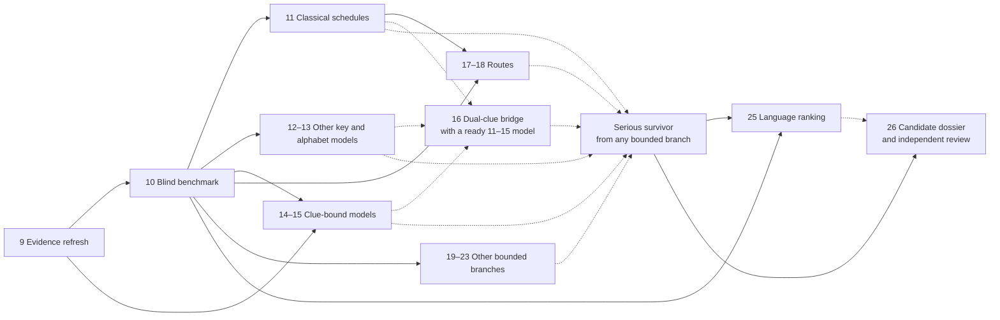

# Future K4 research milestones

These **planned** milestones begin after the eight completed milestones. They are a queue,
not claims that the proposed mechanisms are historically correct. Each one
defines what “complete” means for its own finite family. No finite queue can be
exhaustive over every imaginable cipher, so coverage is reported as model,
parameters, and count rather than as “all K4 methods.”

Every search must use frozen inputs, exact model IDs, a wall-time and operation
cap, deterministic shards, complete coverage counters, and an independent
verifier. A timeout is `unknown`, never `rejected`. Context such as Egypt,
Berlin, the World Clock, directions, or message delivery may motivate a rule;
it is not an extra known plaintext letter.

Counts below are draft candidate or parameter counts for the stated families.
They become binding coverage claims only after the equations, symmetries, and
canonicalization are frozen in an experiment registration. The
[source review](../reports/research-source-review-2026-09.md) records access
limits behind the clue-derived branches.

Unless a card states otherwise, an exact-search pilot is limited to one
core-hour, a heuristic pilot to ten core-hours, and external spend to zero. A
pilot measures throughput; the production registration then freezes a numeric
operation cap, shard count, and wall-time cap before K4 is evaluated.

| Planned milestone | Ready after | Pilot/cap class | Required primary outputs |
| --- | --- | --- | --- |
| 9 Evidence refresh | Now | Source work; no search | Provenance ledger, alternatives, access gaps |
| 10 Blind benchmark | 9 | 10 core-hour harness | Secret-case manifest, top-k/ambiguity metrics |
| 11 Classical schedules | 10 | 1 core-hour exact | Canonical domain, contradictions, survivors |
| 12 Recurrences | 10 | 1 core-hour exact per shard | Seed coverage, survivor table, verifier |
| 13 Unknown alphabets | 10 | Solver cap per instance | Witnesses/cores, backbone relations, unknowns |
| 14 Tableau/keywords | 9–10 | 1 core-hour exact pilot | Frozen corpus, constructor census, survivors |
| 15 Running keys | 9–10 | 1 core-hour exact per corpus | Source windows, offsets, reencryption |
| 16 Dual-clue bridge | 11–15 model | 1 core-hour exact pilot | State joins and verified collisions |
| 17 Affine routes | 10–11 | 1 core-hour per substitution family | Route coverage and inverse traces |
| 18 Ragged routes | 10–11 | 1 core-hour exact core | Route IDs, grid traces, selection count |
| 19 World Clock | 9–10 | 1 core-hour after grammar freeze | Period data, schedule IDs, ablations |
| 20 Physical geometry | 9–10 | 1 core-hour per map | Coordinate map, route census, visual traces |
| 21 Stepping machines | 9–10 | 10 core-hour bounded synthesis | Grammar census, machines, recovery |
| 22 Anomaly cohort | 9–10 | 1 core-hour per extraction family | Cohort, streams, ablations |
| 23 Matrix/fractionation | 10 | 1 core-hour sharding pilot | Matrix coverage, phases, reencryption |
| 24 Program synthesis | Validated earlier primitives | 10 core-hour bounded synthesis | Grammar, nodes, equivalence proofs |
| 25 Language ranking | 10 and survivors | 10 core-hour heuristic pilot | Held-out recovery and family-wise null |
| 26 Candidate dossier | Serious survivor | Review; zero external spend | Reproduction bundle, adversarial findings |

Implementation status: [milestone 10's blind reference benchmark](../reports/milestone-10.md)
is complete as a reusable protocol with one demonstrated reference family. The
milestone 9 evidence refresh remains partial; each future attack family still
requires its own representative corpora and blind calibration before K4
evaluation.

## Planned milestone 9 — refresh evidence and physical geometry

**Question.** Which clue texts, inscription readings, period-correct World Clock
features, and sculpture coordinates can be authenticated before they become
search inputs?

**Work.** Recheck current status and the live steward/checker documentation;
obtain the original November 2025 letter or keep it marked inaccessible;
photographically reconcile the ciphertext, tableau, Morse, raised copper
letters, and front/back orientation; freeze a 1989 World Clock sector and city
label dataset; identify exact Carter notebook editions and pagination. Record
source, retrieval date, transcription confidence, and alternatives.

**Done when.** Every later clue-derived input has a source and uncertainty
class, conflicting readings remain separate, and inaccessible material is not
paraphrased as reviewed. This milestone performs no K4 search.

## Planned milestone 10 — blind recovery benchmark

**Question.** Can an attack select a model without being told the planted ID?

**Domain.** Build deterministic corpora for each forthcoming attack: uniformly
random A–Z messages for transform and constraint tests, plus held-out
plausible-language messages from a separately frozen corpus for scoring tests.
An independent controller chooses secret seeds, keys, routes, and messages.

**Gates.** The attack receives only ciphertext and the same clues it would have
for K4. Report top-1 recovery, top-k retention, ambiguity-set size, runtime, and
false positives. Do not score a language attack only on random-letter text, and
do not use the true model to choose from a returned set. Include wrong-model,
tampered-ciphertext, empty, boundary, and over-budget tests.

**Stop.** An attack family does not touch K4 until its registered recovery
target passes. Failure narrows the tool's competence; it does not exclude the
historical model.

## Planned milestone 11 — classical polyalphabetic schedules

**Question.** Do the 24 known letters fit bounded Vigenère, Beaufort, or variant
Beaufort schedules that were not covered by milestone 1?

**Exact families.** For unrestricted repeating keys, phase only renames key
coordinates. Register $3\cdot32=96$ raw equation/period tuples,
then prove and apply further sign/equation equivalences; these are parameter
tuples, not necessarily 96 distinct constraint sets. Derive required residues
rather than enumerate all $26^t$ words for period $t$. Register progressive
keys as

$$
k_i \equiv q_{i\bmod t} + \left\lfloor\frac{i}{t}\right\rfloor d + s
\pmod{26},
$$

where $i$ is a nonnegative zero-based position and $t$ is a positive integer
period. The unknown seed values $q_0,\ldots,q_{t-1}$, increment $d$, origin
$s$, and resulting key value $k_i$ are residues modulo 26. The seed values
are constrained by the cribs. The raw
$3\cdot32\cdot26\cdot26=64{,}896$ equation/period/origin/increment tuples include a
redundant origin that canonicalization should remove. Also register plaintext-
and ciphertext-autokey seeds of lengths 1–32,
and interrupted keys with at most two reset points selected from a declared
boundary list. Canonicalize equivalent streams before counting.

**Validation and stop.** Plant every boundary period, phase, sign convention,
feedback type, and reset count. Transport crib positions through any route
before applying equations. Exact rejection is allowed only when known-letter
constraints contradict every registered schedule; underdetermined schedules
remain survivors for later scoring.

## Planned milestone 12 — generalized recurrence census

**Question.** Is the decimal five-digit recurrence result a special case of a
nearby modular recurrence?

**Exact domain.** Enumerate every seed, including all-zero seeds, for bases
3–12 and seed lengths 2–6: **7,433,973** seeds. Treat base 26, lengths 2–4, as
a separate **475,228**-seed branch. Those counts use the default recurrence
$t_{i+L} = (t_i+t_{i+1})\bmod b$, where $i$ is a zero-based position, $L$ is
the seed length, $b$ is the base, and $t_i$ is a digit in $0,\ldots,b-1$;
include seeds only. Register alternative
recurrence taps, output offset
0–96, additive/subtractive sign, and whether the emitted sequence begins with
the seed as explicit multipliers. Prove phase or sign reductions before using
them; otherwise count and shard them.

**Limits.** The existing 39-primer filter transfers only to the unchanged
base-10, length-5, offset-zero additive recurrence. It cannot prune another
base, tap, sign, or transported crib arrangement.

**Validation and stop.** Compare exhaustive enumeration with a constraint
solver on small domains, plant maximum seeds and zero seeds, and preserve a
survivor table. Stop at the preregistered product; extend only through a new
registration.

## Planned milestone 13 — unknown-alphabet constraint proofs

**Question.** What is forced when plaintext and ciphertext alphabets are unknown
permutations rather than chosen from a word list?

**Method.** Express crib equations as all-different constraints. Fix only a
proven common rotation of both complete alphabets. Independent component
translations affect global packing and must remain search variables. Use two independent exact engines, such as custom
backtracking and SAT/CP-SAT, with checkable witnesses for satisfiable instances
and independently verified unsatisfiable cores where supported. A solver timeout
is `unknown`.

**New output.** Count alternative alphabet pairs up to declared symmetries when
feasible, and compute backbone predictions: letter positions or relations shared
by every solution. Test whether one known block predicts any letter in the
other. This measures underdetermination without ranking arbitrary witnesses as
English.

**Stop.** Do not claim to enumerate `(26!)²` directly. Report exact counts only
for components or reduced instances for which counting completed.

## Planned milestone 14 — tableau and finite keyword corpora

**Question.** Did K4 use a literal feature of the sculpture tableau or a
documented keyword construction not covered by milestone 8?

**Domain.** Freeze both the printed tableau and an idealized Latin-shift model;
they are different hypotheses. Register row/column reading, header inclusion,
forward/inverse lookup, starting row/column, reversal, and the treatment of the
inscription's anomalous cells. Build a finite, versioned keyword corpus from
authenticated K1–K3 terms, clue terms, place names, and period documents. Record
normalization and deduplication before K4 evaluation.

**Validation and stop.** Reproduce known tableau examples and plant every
constructor. Report corpus size $\times$ constructor count $\times$
orientation count $\times$ phase count before and
after canonical deduplication. No per-letter exception or keyword added after
seeing a near match is part of the original run.

## Planned milestone 15 — documentary running keys

**Question.** Can an authenticated source text generate the K4 key stream under
a simple, reproducible extraction?

**Sources.** Freeze exact editions of K1–K3 plaintext, Carter notebooks and
related excavation text, creator statements, Berlin/clock material, and any
newly authenticated document. Guessed K4 prose belongs in a separate hypothesis
corpus, never the evidence corpus.

**Exact domain.** For each normalized source of length $L$, test all
$\max(L-96,0)$ contiguous 97-letter windows, forward and reversed, under each
registered alphabet/equation/route. Add skip patterns or page transitions only
as separately counted, source-motivated variants. Keep corrected and
as-inscribed K2 versions distinct.

**Validation and stop.** Plant first and last legal offsets and source-boundary
cases. A fluent decryption is only a candidate until the source independently
derives all 97 key positions and exact reencryption passes.

## Planned milestone 16 — dual-clue meet-in-the-middle bridge

**Question.** Can the two known blocks constrain the hidden state between them?

The blocks start at zero-based positions 21 and 63, a start-to-start distance
of 42. That distance is useful for propagating a registered state machine in
both directions; it is **not evidence for period 42**.

**Method.** For each reversible recurrence or small-state family, enumerate
states consistent with `EASTNORTHEAST` forward from the first block and states
consistent with `BERLINCLOCK` backward from the second. Join on canonical
middle states, then verify every collision against both blocks and all other
known positions. Split-state fingerprints and collision counts are preserved.

**Validation and stop.** Plant models at boundary state sizes and perform a
train-on-one-block/test-on-the-other ablation. Because both blocks are public,
this is constraint reduction, not a blinded prediction claim.

## Planned milestone 17 — affine routes on the 97 positions

**Question.** Does a simple permutation of positions explain why aligned models
fail?

Because 97 is prime, every map $i\mapsto ai+b\pmod{97}$ with zero-based
position $i$, $1\le a\le96$, and $0\le b\le96$ is a permutation:
**9,312 routes**. Reversal is already the case
$a=-1$; composing two affine maps stays affine and adds no new route.

**Method.** Recheck the full route family as a small regression control; the
milestone-1 letter-multiplicity certificate already excludes every pure
transposition. The actual new search composes routes only with named
substitution families that have passed milestone-10
calibration. Transport both plaintext and ciphertext crib coordinates in the
declared direction; save the inverse mapping and a full reencryption trace.

**Stop.** Count $9{,}312\times N_{\mathrm{substitution}}$ after symmetry
deduplication, where $N_{\mathrm{substitution}}$ is the registered number of
substitution models.
Reject only that product, not arbitrary transpositions.

## Planned milestone 18 — ragged columnar and route transpositions

**Question.** Do bounded hand-sized grids expose a compound model missed by
aligned tests?

**Exact core.** For widths 2–8, exhaust every column order. The sum of the
factorials is **46,232**. Cross these with declared row fill/read directions,
top-to-bottom versus bottom-to-top columns, reversal, and exact ragged-cell
handling. Do not pad the 97 letters unless padding is a separate explicit
variant.

**Wider branch.** Widths 9–32 may use a small registered set of clue-derived or
keyword-derived orders; they are not exhaustive over all permutations. Route
grammars on rectangles or sculpture-shaped masks must enumerate legal moves
and reject disconnected or duplicate-cell routes.

**Validation and stop.** Plant every ragged boundary and inverse route. Search
selection, including width choice, is included in later null calibration.

## Planned milestone 19 — World Clock schedules

**Question.** Can period-correct features of Berlin's World Clock define a
small key schedule rather than merely suggest a plaintext theme?

**First finite grammar.** Freeze the 24 sectors and rotating 1–24 hour ring.
Register start sector (24), direction (2), initial hour (24), four declared
readouts (`sector`, `hour`, `sector+hour`, `sector-hour`), and two sculpture
orientations: **9,216 schedules** before canonical deduplication. Map values
0–23 explicitly into A–X; addition and subtraction are reduced modulo 24. In
this draft, the sector advances one step per letter in the chosen direction and
the hour advances after each 24 emitted positions. A–X are key values in this
draft schedule; they do not restrict plaintext or ciphertext to 24 letters.
These are parameter tuples
pending a frozen period-correct clock model, not yet an exhaustion claim. Y and
Z are not silently merged. The 97th symbol is a
declared residual after four 24-step cycles, not discarded.

**Ablations.** Compare period-correct labels, geometry-only sectors, and modern
labels as separate data. The modern version is a negative/control variant, not
a substitute for 1989. Add timezone or city-name extraction only after its
normalization and count are frozen.

**Validation and stop.** Plant all readouts and boundary hours. The clock clue
motivates this grammar but does not make a surviving schedule authentic.

## Planned milestone 20 — directional and sculpture geometry routes

**Question.** Can `EAST`/`NORTHEAST`, the sculpture layout, or viewing direction
select a finite physical route?

**Domain.** On each authenticated coordinate map, define eight compass bearings,
forward/backward viewing, wrap/no-wrap, and a finite route grammar such as
straight, alternating two-bearing, spiral, or bearing changes at line breaks.
Register whether directions select a traversal or a key shift; these are
competing hypotheses. Enumerate every cell exactly once unless a separately
declared mask says otherwise.

**Validation and stop.** Visualize source-to-destination indices, verify the
inverse permutation, plant each grammar production, and forbid manual cell
skips. Direction words remain their known plaintext at registered positions;
their meaning is only a soft rationale for the route family.

## Planned milestone 21 — bounded stepping machines

**Question.** Could clock, direction, and delivery clues describe a small
reversible transducer?

**Grammar.** Enumerate machines with 2–4 states, one or two 24- or 26-step
counters, source-supported transition triggers (position, line boundary,
known-direction event), and affine letter output. Require invertibility and
canonicalize renamed states. A separate rotor branch may use a small frozen set
of tableau-derived wirings, steps, and turnover positions; arbitrary $26!$
wirings are outside scope.

**Validation and stop.** Generate machines from a grammar whose branching
factor, depth, canonical count, and cap are recorded before K4. Recover held-out
machines blindly in milestone 10. Near matches do not authorize added states or
per-position shifts.

## Planned milestone 22 — anomalies as a cohort

**Question.** Do deliberate irregularities encode a short control stream?

**Inputs.** After milestone 9, freeze a finite list containing K1/K2 spelling
and inscription differences, raised copper letters, verified Morse elements,
tableau irregularities, line lengths, and physical offsets. Preserve uncertain
readings as parallel alternatives with provenance.

**Method.** Register complete extraction rules—difference values, positions,
gaps, binary classes, reading direction, and cyclic repetition—and apply every
rule to the entire cohort. Use leave-one-anomaly-out ablations to show whether a
result depends on a cherry-picked item.

**Stop.** No anomaly may be omitted after looking at K4 unless the omission was
predeclared. An extracted short sequence must feed a named cipher and reencryption
path; suggestive words alone do not pass.

## Planned milestone 23 — matrix and fractionating models

**Question.** Do small linear blocks or a 26-symbol fractionation explain the
known letters?

**Exact $2\times2$ branch.** Enumerate all 456,976 matrices over
$\mathbb{Z}/26\mathbb{Z}$; exactly
**157,248** are invertible. With every two-letter affine offset, the full affine
family has **106,299,648** models before phase and route factors. Shard by matrix
and verify invertibility independently modulo 2 and modulo 13.

**Larger branch.** Solve $3\times3$ constraints algebraically modulo 2 and 13 and join
with the Chinese Remainder Theorem. Do not describe $26^9$ matrices as fully
brute-forced if solver pruning or a cap is used.

**Fractionation.** Preserve all 26 ciphertext symbols with a declared 2×13
coordinate system first. A conventional 25-letter I/J merge is a different,
directly testable model because K4 contains both letters; reversible escape
variants must be declared, and free repair exceptions are forbidden.

**Validation and stop.** Plant singular and invertible matrices, every block
phase, and prefix/suffix policy. Reencrypt all 97 positions exactly.

## Planned milestone 24 — bounded program synthesis

**Question.** Can a short composition of already tested primitives explain K4
without a parameter per letter?

**Grammar.** Synthesize one- and two-layer programs from validated substitutions,
recurrences, affine/ragged routes, tableau lookups, and small clock/state
schedules. Constants must come from frozen sources or small declared ranges.
Canonicalize equivalent programs by their complete 97-position action and
record both source program and canonical behavior. That shortcut is valid only
for input-independent transforms. Feedback programs are merged only after
functional equivalence is proved for all inputs, never because they agree on
one 97-letter test message.

**Controls.** Calibrate grammar depth and search order on secret held-out
programs. Penalize description length, include all search choices in false
positive calibration, and compare source-supported constants with matched
random constants. A compact fit is a hypothesis, not evidence of historical
use.

**Stop.** Fix grammar version, maximum depth, node cap, and beam/restart rules.
Extending the grammar requires a new experiment ID.

## Planned milestone 25 — language scoring and heuristic attacks

**Question.** Can underdetermined exact survivors be ranked without manufacturing
English?

**Models.** Freeze character n-gram models (orders 3–6), word segmentation,
training corpus, normalization, and held-out corpus. Compare at least two
independent scorers. Score only unconstrained positions when known plaintext
would otherwise dominate.

**Calibration.** For each attack family, run at least 100 secret planted cases
at K4 length and comparable key difficulty. Register restarts, proposals,
temperatures, beams, termination, and every model choice. The null repeats the
entire selection process, including choice among widths, routes, scorers, and
restarts. Report top-k recovery and calibrated family-wise false-positive
rates.

**Stop.** If recovery misses its registered target (normally at least 90% for
the intended family), improve the method on synthetic data or mark it
inadequate. Do not reinterpret a fluent K4 output as validation.

## Planned milestone 26 — adversarial candidate dossier and external review

**Question.** Does any surviving candidate remain compelling when another team
tries to break it?

**Dossier.** Require exact 97-letter reencryption, all clue positions, an
independently derived key, complete algorithm, source provenance, canonical
parameters, sensitivity analysis, search-space accounting, null calibration,
and runnable artifacts. Compare alternative plaintexts/keys of equal or shorter
description length and perturb clues, sources, routes, and scorers.

**Independent review.** A fresh-context implementation must receive the model
specification rather than project source, reproduce the candidate, and document
disagreements. Reviewers check crib transport, sign, phase, indexing, ambiguous
normalization, data leakage, post-selection, and whether a claimed historical
source was available at the relevant time.

**Stop.** Internal agreement is not authentication. External checking,
submission, payment, publication, or contacting third parties remains a
separate user-authorized action. A rejected candidate and its reason are
preserved so the same fit is not rediscovered.

## Dependency order

Milestones 9 and 10 are shared gates. Milestones 11–15 can then run as exact
key/substitution branches; 16 consumes their reversible state models. Milestones
17–20 add routes and clue-derived schedules. Milestones 21–24 combine only
validated primitives. Milestone 25 ranks survivors, and milestone 26 is reserved
for a candidate that already passes every earlier applicable gate.

The diagram highlights selected gates. Solid arrows are prerequisites; dashed
arrows show optional sources of a serious survivor, not prerequisites for
milestone 25. The table above gives each milestone's full readiness rule.

