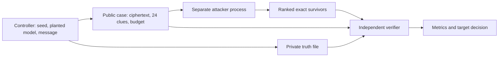

# Milestone 10 — blind recovery reference benchmark

The registered exact reference attack passed its synthetic gate. Across 160
in-family cases, the planted canonical model and complete plaintext were
retained and ranked first **160/160** times. None of the 140 out-of-family or
tampered cases had an in-family survivor. This calibrates one deliberately small
family, not all forthcoming attacks and not a K4 solution.

## Design and isolation

[BLIND-0004](../experiments/BLIND-0004.json) and the final
[conventions](../docs/blind-benchmark-conventions-v4.md) were frozen before case
generation. The controller selected seeds, 97-letter plaintexts, model,
keys, and routes. It saved only ciphertext, 24 known-position letters, and a
budget in the public file. The attacker ran in a separate process with that
file; planted IDs and full plaintexts stayed in a controller-private file until
an independent verifier scored the output. The preregistration held only a
SHA-256 commitment to the 256-bit seed. After the attacker exited, the seed
was revealed; the verifier checked the commitment and regenerated every public
and private case from it. Case IDs were shuffled without revealing labels.
The verifier bound the manifest's targets, cohort sizes, seed commitment, and
other scientific fields to the frozen registration and checked input and code
hashes. It separately enumerated the registered domain, checked exact
survivor content and ordering, and rejected missing or fabricated candidates.

The exact attack covered identity/reverse order and standard-A–Z Vigenère,
variant Beaufort, and Beaufort with key periods one or two. Vigenère and variant
Beaufort are equivalent under key negation; equal two-letter keys reduce to
period one. The structural ranking is fixed before seeing truth. There is no
English score. The five-line [held-out prose corpus](../fixtures/blind-heldout-prose.txt)
was sampled independently from random-letter messages, with public clue letters
inserted at the fixed positions. Consequently the prose check does not validate
a language ranker, and the altered positions limit prose naturalness.

## Preserved run

[Run 001](../results/BLIND-0004/run-001/completion.json) performed all
$300\times8=2400$ registered model checks in 0.141 seconds of controller wall
time; there was no timeout or unknown. The sum of the attacker's per-case
timers was 0.0043 seconds. The completed run and all inputs are hash-linked in
the append-only registry and repository audit.

The earlier [BLIND-0001 pilot](../results/BLIND-0001/run-001/completion.json)
published its seed before attack and is **invalid as blind calibration**; its
artifacts are preserved, not counted. BLIND-0002 run 001 failed when moving a
private file across filesystems after the attacker exited. It is preserved as
a failed run. [BLIND-0002 run 002](../results/BLIND-0002/run-002/completion.json)
replayed identical public cases after a transport-only fix, so it was not an
unseen blind test. Review also found that its verifier trusted scientific
fields from the run manifest without binding them to the frozen registration.
[BLIND-0003 run 001](../results/BLIND-0003/run-001/completion.json) used a fresh
seed, but its verifier omitted an exact implementation-path set check and its
runner checked the wall cap before final artifact hashing. The changed
historical code is preserved in byte-matching snapshots. BLIND-0004's seed and
public cases are distinct from all earlier runs; none of those runs contributes
to the metrics below. The current verifier can recheck BLIND-0002 and
BLIND-0003 results, with the source-replay limitation documented in the
[final convention](../docs/blind-benchmark-conventions-v4.md).

| Cohort | Cases | Exact planted ID and plaintext retained | Top 1 | Top 5 | Any survivor | Largest ambiguity set |
| --- | ---: | ---: | ---: | ---: | ---: | ---: |
| Uniform random positive | 120 | 120 | 120 | 120 | 120 | 1 |
| Held-out prose positive | 40 | 40 | 40 | 40 | 40 | 1 |
| Period-three negative | 120 | N/A | N/A | N/A | 0 | 0 |
| Crib-position tamper negative | 20 | N/A | N/A | N/A | 0 | 0 |

Aggregate retention, top-one, and top-five were each 100%; negative survivor
rate was 0%; unclassified overrun was zero. The registered targets were 100%
retention, at least 90% top-one, at least 99% top-five, at most 1% negative
survivors, and zero unclassified overrun. All passed. Ambiguity-set size was one
for every positive and zero for every negative. These unusually clean numbers
reflect the narrow, identifiable model and 24 exact clues. They should not be
extrapolated to flexible alphabets, longer keys, routes, or English selection.

## Limits and next gate

The benchmark provides a reusable blind controller/verifier protocol and one
calibrated reference family. A later attack family must register its own
representative corpus, transformation
domain, failure cases, and recovery targets before testing K4. Milestone 9's
unverified sculpture geometry and period Clock labels remain unavailable for
clue-derived branches. No K4 model was searched in this run. A tamper outside
the 24 known positions would be undetectable by this crib-only exact attack,
which is why the tamper cohort changed letters at known positions.

Reproduce the same cases to a **new** run directory with
`python3 experiments/run_blind_v4.py SEED_FILE results/BLIND-0004/run-002`,
using the revealed seed from run 001 in a file outside the repository. This
reproduction is necessarily unblinded; another blind trial requires a new
registration and fresh commitment. Directly check
the saved run with
`python3 verification/verify_blind.py results/BLIND-0004/run-001`.
