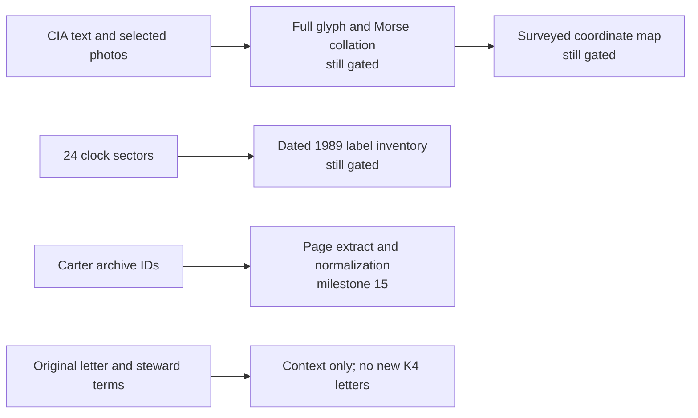

# Milestone 9 — evidence refresh and physical geometry

Audited 20 September 2026. This is an **evidence audit with unresolved physical
and period-data gates**. It ran no K4 search, added no plaintext letters, and
did not change frozen experiment inputs. The machine-readable [source and gate
ledger](../evidence/milestone-9.json) records URLs, access classes, retrieval
dates, locators, alternatives, and selected SHA-256 hashes. Its baseline hashes
anchor the five earlier evidence files.

## What is directly established

The [CIA sculpture page](https://www.cia.gov/legacy/headquarters/kryptos-sculpture)
publishes 28 encoded-text and 28 tableau rows. A mechanical row comparison
found exact agreement with the frozen `reference-material.json` transcription,
including four question marks and the longer N-prefixed tableau row. This is
**text-to-text agreement**, not proof that every copper glyph matches. CIA's
front-view convention places the petrified tree left, ciphertext left, and
tableau right; it says the tableau is reversed to be read from the back. The
entrance compass and lodestone are distinct from the courtyard screen, pool,
and petrified wood.

I examined pixels in [Gillogly's 1999 photo
gallery](https://www.voynich.net/Kryptos/), including
[`obkr.jpg`](https://www.voynich.net/Kryptos/full/obkr.jpg), the lower cipher
triplet, [`centeredtableau.jpg`](https://www.voynich.net/Kryptos/full/centeredtableau.jpg),
and [`morse1.jpg`](https://www.voynich.net/Kryptos/full/morse1.jpg). They
visibly confirm the `?OBKR` boundary, perforated rows beneath it, reversed
tableau lettering on the other side of the screen, and a segment with two
parallel Morse-like dot/dash tracks. These checks do **not** independently
establish every letter in K4, all 28 tableau rows, or a continuous Morse
transcription. Curvature, shade, perspective, and frame edges obscure cells.
The [NDY](https://www.elonka.com/kryptos/rubbings/images/ndy.jpg) and
[AHR](https://www.elonka.com/kryptos/rubbings/images/ahr.jpg) rubbings from
[Dunin's 2002 visit](https://www.elonka.com/kryptos/) show the named fragments
of the line beginning `ENDYAHROHN`; her adjacent
[photographic close-ups](https://www.elonka.com/kryptos/rubbings/images/ahrCloseup4.jpg)
show some of that line on the screen. Dunin reports that `Y`, `A`, and `R`
are displaced by a couple of centimeters. The images show an uneven baseline,
but their smudging, cropping, and perspective do not independently establish
that distance. Treat the displacement as an attributed observation, not a
measured clue or a demonstrated encryption instruction. The
conflicting reported `RQ` and `YR` Morse readings remain alternatives. No
picture supplies survey-quality coordinates, bearings, or a justified
front/back index transform. The [Library of Congress Highsmith image
record](https://www.loc.gov/pictures/item/2011631531/) identifies a larger
archival photograph worth obtaining for further collation; its catalog entry
does not itself resolve the unreadable cells.

The [original two-page Sanborn letter](https://s3.documentcloud.org/documents/26229389/adobe-scan-nov-12-2025.pdf?t=1763155112693),
dated 12 November 2025, was read as a scan. On page 1, Sanborn distinguishes
discovery of scrambled K4 plaintext from a discovered decryption method; he
states K4 has not been decrypted. He identifies the Berlin Clock as the World
Clock, connects the message to a late-1986 Egypt trip and the fall of the
Berlin Wall, and says the sequence from entrance Morse through K5 concerns
delivering a message. Page 2 describes K5 as 97 characters, with a similar
coding system and `BERLINCLOCK` in the same position. These are attributed
creator statements and context, **not** a new K4 crib, clock configuration,
or cipher algorithm. PDF text extraction is unreliable, so the ledger
paraphrases only visually checked passages and records the downloaded PDF hash.

The [Paradigm K4 page](https://www.paradigm.xyz/kryptos/k4) displays the
97-letter ciphertext and labels K4 unsolved. Its [Project Kryptos
announcement](https://www.paradigm.xyz/writing/kryptos) says Paradigm became
steward, uses an automated verifier against a solution Sanborn supplied, and
charges $1 to discourage brute forcing. Its Q&A describes local hashing of
the entered plaintext, a Google Cloud KMS HMAC on that hash, and wiping the
entry laptop. It says K5's ciphertext is for later release. The separate
[CTF rules](https://www.paradigm.xyz/kryptos-ctf/rules) define ten independent
$1,000 prize puzzles with no entry fee and say K4 has no prize unless
otherwise announced. The displayed “Decrypt K4” control was not used;
submission behavior, uptime, and payment flow remain unverified. The CTF is
not a source of K4 plaintext.

The [Berlin city page](https://www.berlin.de/sehenswuerdigkeiten/3561749-3558930-weltzeituhr.html)
supports 24 etched time-zone panels and a rotating hour ring. It also says
incorrect time-zone assignments were corrected and more city names added
after reunification. A [contemporary 1997
article](https://taz.de/Berliner-Namenswechsel/!1379169/) names several older
labels, including its spelling “Alma Ater,” but does not give every label,
panel order, or sector map. This spelling and list are retained as secondary
evidence, not silently corrected to a modern map. A [Berlin Senate 2019
publication](https://www.berlin.de/aktuell/ausgaben/2019/dezember/aktuell-104-webversion.pdf)
(PDF page 50) says the **original** 24 panels carried 80 city names and that
Athens was excluded during SED approval. That count is not a 1989 count or
panel inventory. A search-indexed excerpt of [Robert Burgaß's conservation
account](https://bc.pollub.pl/Content/634/PDF/zabytki.pdf) suggests names
changed after 1969 and that no name-panel changed between the 1985
reconstruction and 1997 modernization. Its PDF body could not be read, so both details
remain provisional; they are a reason to seek the 1985 restoration record,
not a source of labels. Retrospective totals also conflict, and this audit
adopts **no 1989 city-name total**. A complete dated 1989
inventory is still missing; only the 24-sector count is an authenticated
clock feature. Current labels cannot substitute for the old configuration.
Berlin's [monument register](https://denkmaldatenbank.berlin.de/daobj.php?obj_dok_nr=09020854)
identifies object `09020854`, a useful archive-request locator rather than
a panel inventory.

The [Oxford Tutankhamun Spatial Archive catalog](https://tutankhamun.griffith.ox.ac.uk/journals-and-diaries)
separates Carter's archaeological journals, his diaries, Mace's archaeological
journals, and [Minnie Burton's personal diary](https://tutankhamun.griffith.ox.ac.uk/journals-and-diaries/burton-m-mss).
It identifies Carter journal season 1 as `TAA i.2.1.25–53`, season 2 as
`TAA i.2.1.77–115`, Mace journal season 1 as `TAA iv.2`, and Mace journal
season 2 as `TAA i.2.2`. Burton's diary is `Burton, M. MSS` (4 May 1922–20
October 1926), not a Carter notebook. The catalog describes Carter diaries
from seasons 1–3 separately; the journal IDs above must not be assigned to
them. For Carter's journals, entries appear on odd-numbered right pages, with
optional notes on even-numbered facing pages. The [season 2
object record](https://tutankhamun.griffith.ox.ac.uk/index.php/journals-and-diaries/taa-i2177-115-2nd-season)
dates it to 3 October 1923–9 February 1924 and offers transcription with
manuscript scans. These are exact archive and pagination leads; a journal,
diary, manuscript transcription, and printed edition are distinct candidate
corpora. The text extract, page span, correction policy, and normalization
must be frozen in milestone 15 before a running-key search.

The [Smithsonian Sanborn oral-history catalog](https://www.aaa.si.edu/collections/interviews/oral-history-interview-jim-sanborn-15700)
is search-indexed, but the full transcript page returned HTTP 500 during this
audit. Search snippets are not used as coordinate or cipher fixtures.

## Source classes and remaining gates

| Source or feature | Supported now | Not supported yet |
| --- | --- | --- |
| Inscription and tableau | CIA text rows match frozen text; selected gallery pixels corroborate features | Independent photo or rubbing collation of every glyph |
| Morse and irregular letters | Entrance photo segment shows two dot/dash tracks; Dunin's NDY/AHR rubbings and account identify displaced letters | Continuous raw marks, reading direction, independently measured letter offsets |
| Physical placement | CIA front/back convention and component descriptions | Metric coordinates, bearings, camera model, index transform |
| World Clock | 24 sectors, 80 **original** names by a later Berlin Senate account, and later label changes | Dated ordered 1989 city/sector/spelling inventory and 1989 count |
| Carter sources | Distinct Carter and Mace journal IDs, Carter diaries, Burton diary, and journal pagination convention | Frozen page text and normalization for milestone 15 |
| Letter and steward | Original scan and public Paradigm terms read | Live verifier behavior; no submission made |

## Acquisition and measurement specifications

To close the inscription gate, obtain a date-stamped, lossless image set or
rubbed facsimile covering **every** ciphertext and tableau row, including
overlapping frames at panel joins and the `?OBKR` transition. Record image
provenance, view side, camera direction, scale, and each ambiguous glyph as
separate alternatives. Have two independent readers transcribe each physical
row before comparing either reading with the CIA text and frozen baseline.
For Morse, capture each complete copper run with both ends, nearby compass
orientation, and a raw dot/dash/space sequence before interpreting letters.
The Highsmith negative and its full-resolution derivative are an acquisition
lead, but one angled frame cannot guarantee full coverage.

To close the geometry gate, request an as-built site or conservation survey of
the courtyard and entrance components, or calibrated overlapping photographs
with known scale points. Define origin, axes, north reference, units, coordinate
uncertainty, view side, and an explicit front/back transform. For the `Y/A/R`
irregularity, measure glyph center and row baseline in that frame with a
reported uncertainty; do not infer centimeters from paper size or an oblique
photo. Preserve older and current physical states separately if repairs
altered the work.

For the World Clock, seek the original or 1985 restoration panel inventory,
dated full-circumference photographs from **1985–1996**, and the 1997
pre-change documentation from Bezirksamt Mitte or Landesdenkmalamt Berlin,
using monument object `09020854`. The deliverable is one row per observed
city name with the exact spelling, sector/time-zone panel, order within panel,
source image or folio, date range, transcription confidence, and competing
readings. First read the Burgaß article's body and footnote 10 to test the
indexed 1985–1997 claim. Neither present-day labels nor the 1969 original
80-name count should fill missing 1989 cells.

The ledger marks the letter/steward source review closed, photo work partial,
1989 clock inventory and metric geometry open, and the running-key corpus
deferred to milestone 15. Thus the milestone's **full physical and period-data
work remains incomplete**. Later milestones may use only supported facts with
their uncertainty classes; they may not turn unreadable pixels, modern clock
labels, or plausible coordinates into frozen search inputs.
